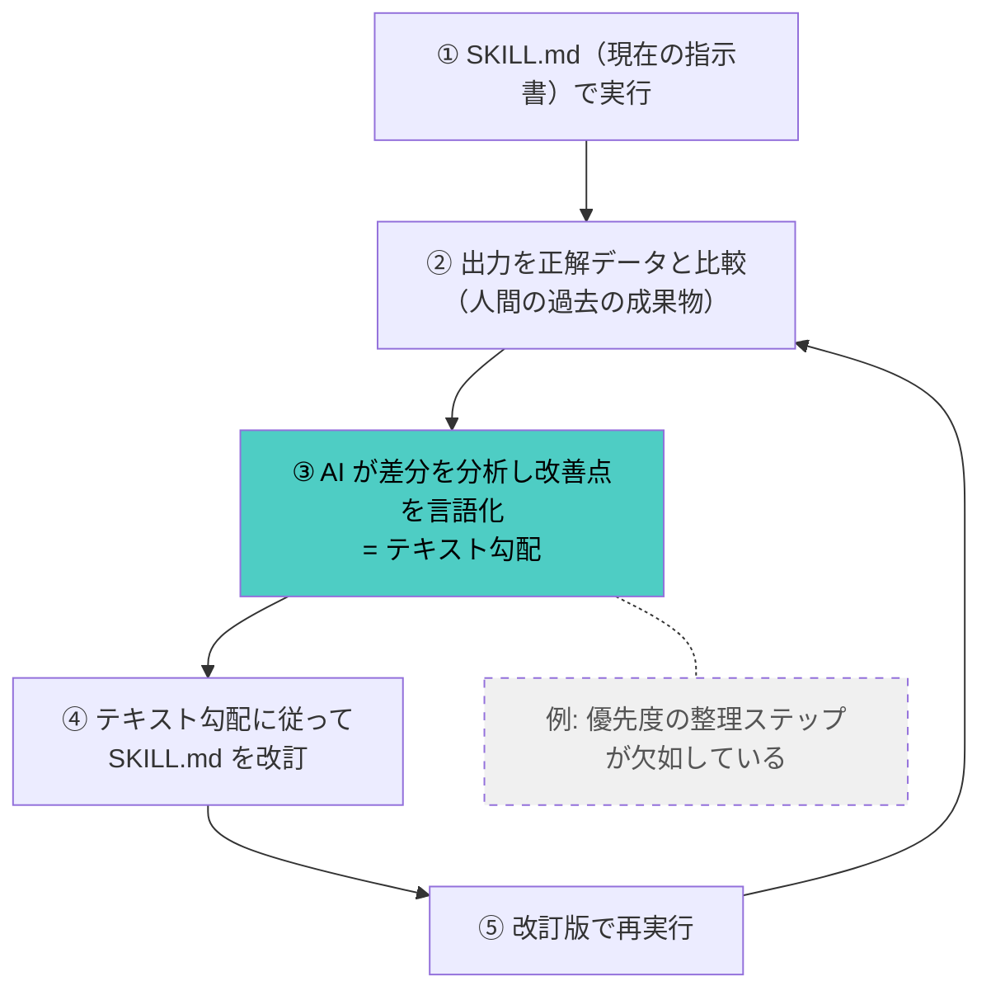
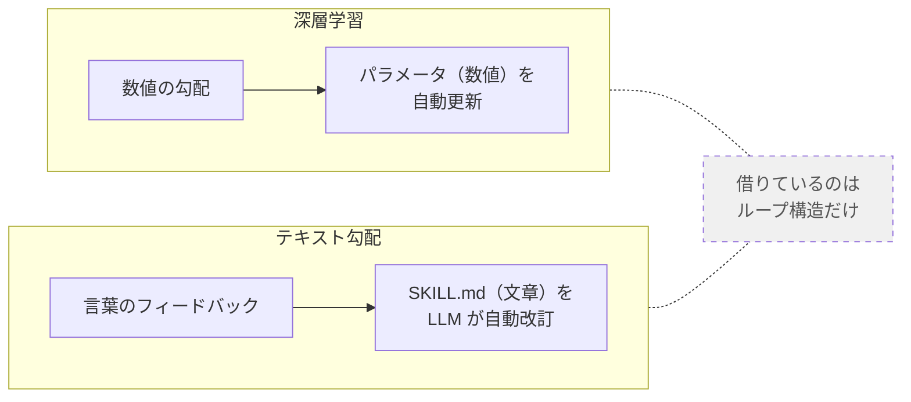
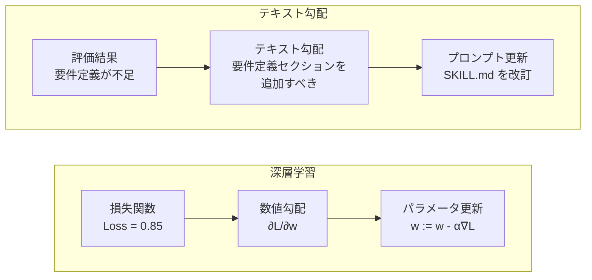
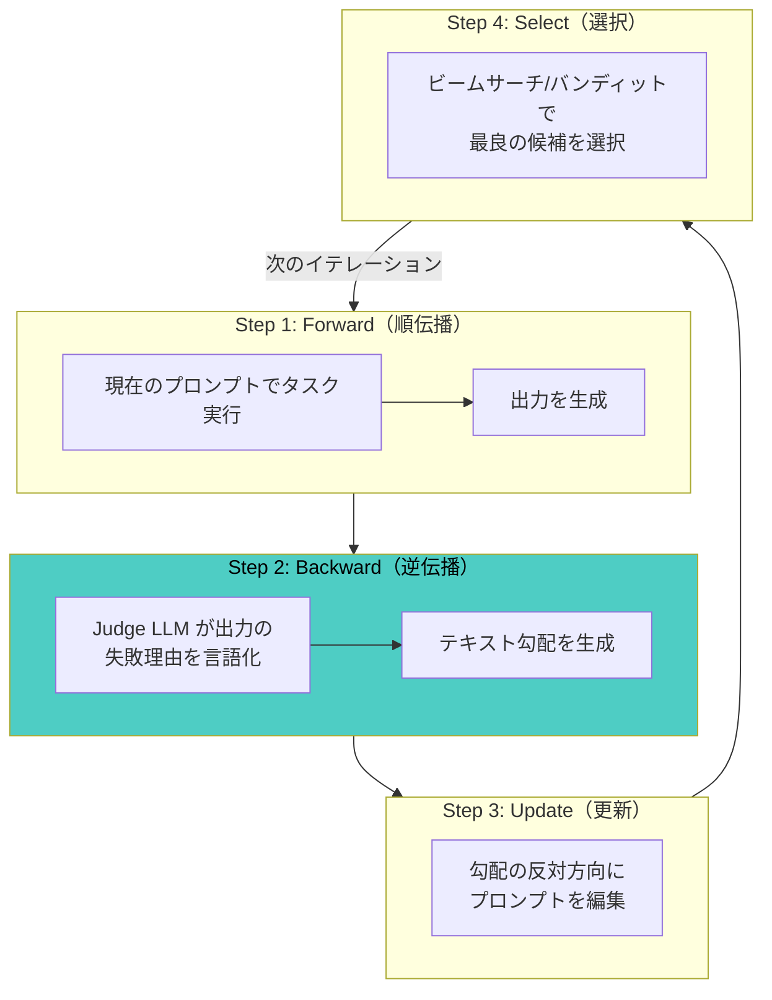
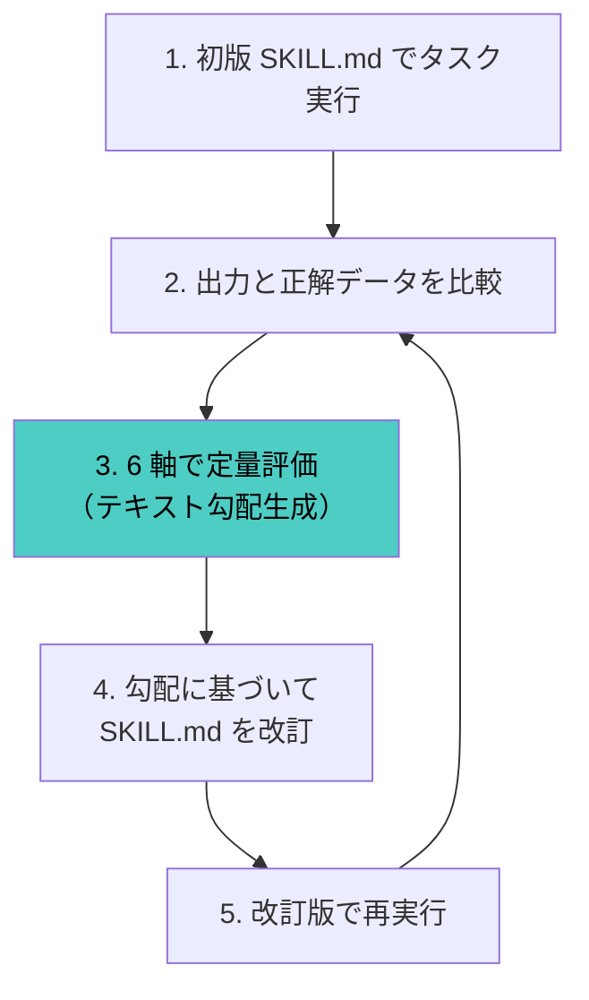
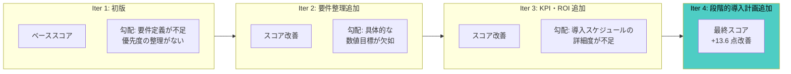
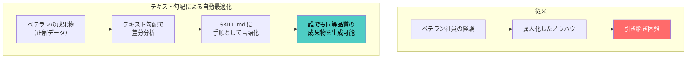
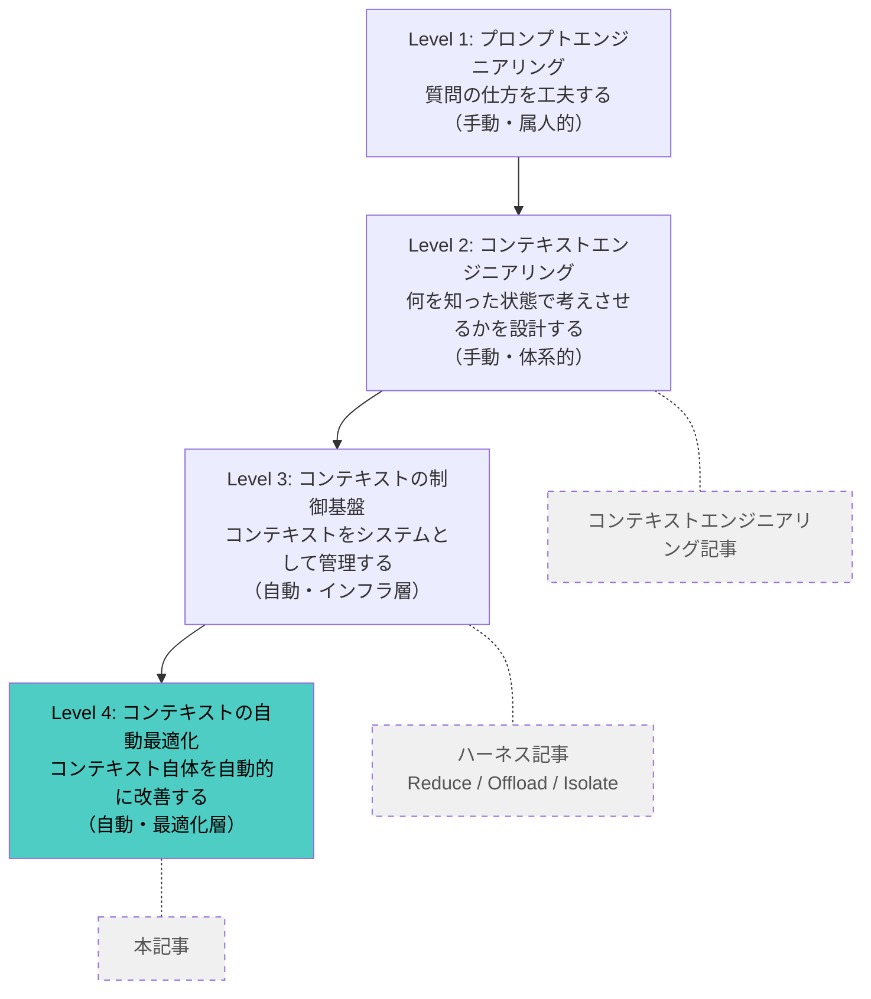

# Claude Code スキルの自動最適化 — テキスト勾配で「職人芸プロンプト」を工学に変える

「プロンプトは職人芸」——そんな時代が終わりつつあります。

[@yusuke_post さん](https://x.com/yusuke_post/status/2027348800331972703) が発表した [X 記事](https://x.com/i/article/2026959443972530176) では、**プロンプトエンジニアリングを自動化する研究を応用して Claude Code の Skills を自動最適化**する手法が紹介されています。ヒアリングメモから SaaS 導入提案書を生成するスキルを題材に、4 イテレーションで 13.6 点のスコア改善を達成しました。

[@kgsi さん](https://x.com/kgsi/status/2027603672860074265) も「この取り組みすごい、ナレッジが溜まっている企業や組織ほどこの仕組みで効果が出そう」と反応しています。

## 全体像：何がどう繋がっているのか

この記事で扱う内容を先に俯瞰します。

### 課題

Claude Code の Skills（SKILL.md）は、タスクの手順を定義する「指示書」です。しかし、良い指示書を書くのは難しく、試行錯誤が属人的になりがちです。


### 解決策：テキスト勾配による自動改善ループ

深層学習がパラメータを自動で最適化するように、**SKILL.md を自動で最適化する**のがテキスト勾配です。



> 4 回繰り返すだけで 13.6 点のスコア改善を達成。

### 一言でいうと

SKILL.md も結局は「プロンプト」です。人間が手で書くと主観や経験に依存する「職人芸」になってしまいます。そこで、**スキルの利用結果をフィードバックとして、AI（LLM）自身に SKILL.md を改善させる**のがこの手法の核心です。

### 「テキスト勾配」は深層学習そのものではない

「テキスト勾配」という名前から深層学習を直接使う印象を受けますが、実際には異なります。深層学習の「勾配降下法」という**最適化ループの考え方だけを借用**し、実際の改善処理は LLM が自然言語で行います。



数学的な勾配計算は一切ありません。「出力のどこがダメだったか」を LLM に言語化させ、その指摘に基づいて SKILL.md を書き直す——これを繰り返すだけです。

### 深層学習との対比

| | 深層学習 | テキスト勾配 |
|---|---|---|
| **最適化対象** | ニューラルネットの重み（数値） | SKILL.md の指示文（自然言語） |
| **正解データ** | ラベル付きデータセット | 人間が過去に作成した成果物 |
| **損失関数** | 数値的な誤差（交差エントロピー等） | 出力と正解の品質差（6 軸評価） |
| **勾配** | 数値ベクトル（∂L/∂w） | **LLM が生成する自然言語のフィードバック** |
| **更新** | w := w - α∇L | **LLM が SKILL.md を改訂** |
| **収束** | 数百〜数千エポック | **3〜5 イテレーション** |

要するに、**「人間の過去の仕事を教師データに、AI が AI 用の指示書を自動で育てる」** 仕組みです。以下のセクションでは、この仕組みの技術的背景、具体的な手法、実践方法を詳しく解説します。

## 背景：プロンプト最適化は何が難しいのか

### 2 つの根本的困難

プロンプトエンジニアリングには、2 つの本質的な課題があります。

1. **LLM の不透明性**: プロンプトが LLM にどのような影響を与えるのかを正確に把握することが難しい
2. **探索空間の広さ**: 自然言語プロンプトの表現パターンは無限に近く、最適な表現の発見が困難

人手による試行錯誤では、再現性が低く、属人化しやすいという問題もあります。

### 既存のアプローチ

プロンプト自動最適化の研究は、大きく 4 つのパラダイムに分類されます。

| パラダイム | 代表的手法 | アプローチ |
|-----------|----------|----------|
| **LLM ベース最適化** | APE, OPRO | LLM 自身にプロンプトを生成・評価させる |
| **進化的計算** | EvoPrompt | 遺伝的アルゴリズムでプロンプト集団を進化 |
| **勾配ベース最適化** | ProTeGi, TextGrad | テキスト勾配で方向性を持った改善 |
| **強化学習** | RLPrompt | 報酬最大化によるプロンプト探索 |

@yusuke_post さんが採用したのは、3 番目の**テキスト勾配ベース**のアプローチです。

## テキスト勾配とは何か

### 深層学習の勾配との類比

深層学習では、損失関数の勾配を計算し、パラメータを「誤差が減る方向」に更新します。テキスト勾配はこれと同じ考え方を自然言語に適用します。



### ProTeGi のアルゴリズム

ProTeGi（Prompt Optimization with Textual Gradients）は、[Pryzant et al., EMNLP 2023](https://aclanthology.org/2023.emnlp-main.494/) で提案された手法です。



- **Forward**: 現在のプロンプトでタスクを実行し、出力を生成する
- **Backward**: 別の LLM（Judge）が出力の失敗理由を自然言語で記述する。これが「テキスト勾配」
- **Update**: テキスト勾配の「反対方向」にプロンプトを編集する（指摘された欠陥を補う）
- **Select**: 複数の候補プロンプトからビームサーチやバンディットアルゴリズムで最良のものを選択

テキスト勾配の例:

> 「現在のプロンプトは、ヒアリング内容の優先度判定を指示していないため、顧客の主要課題と副次的要望が混在した提案書が生成されている。優先度に基づく整理ステップを追加すべき。」

### TextGrad: PyTorch ライクな実装

[TextGrad](https://tailoredai.substack.com/p/automating-prompt-optimisation-a) は ProTeGi の概念を PyTorch 風の API で実装したフレームワークです。

```python
# TextGrad の概念的な使い方
variable = Variable(system_prompt, learnable=True)
output = llm(variable, input_data)
loss = evaluate(output, expected_output)
loss.backward()       # テキスト勾配を生成
optimizer.step()      # プロンプトを更新
```

`loss.backward()` がテキストによるフィードバックを生成し、`optimizer.step()` がそのフィードバックに基づいてプロンプトを書き換えます。

## Skills の自動最適化：@yusuke_post さんのアプローチ

### 着想

既存のプロンプト自動最適化研究は「数文のプロンプト」を対象にしていました。@yusuke_post さんは、これをより長い構造化ドキュメントである **Claude Code Skills（SKILL.md）** に適用しました。

### 前提：Claude Code Skills とは

[Skills](https://code.claude.com/docs/ja/skills) は、`SKILL.md` ファイルにタスクの手順を定義すると、Claude Code がそれを参照して作業してくれる仕組みです。

```
.claude/skills/proposal-generator/
├── SKILL.md           # タスク手順（最適化対象）
└── references/
    └── template.md    # 出力テンプレート
```

### 最適化の仕組み

核心のアイデアはシンプルです。

> 「人間が過去に作成した成果物を正解データとして、実際にスキルを実行し、生成結果と正解データの差分を自動分析して、スキルを継続的に改善する」



### 題材：ヒアリングメモ → SaaS 導入提案書

実験の題材は、「ヒアリングメモから SaaS 導入提案書を自動生成する」スキルです。

- **入力**: 顧客ヒアリングの議事録
- **正解データ**: 人間が過去に作成した提案書
- **出力**: スキルが自動生成した提案書

### 6 軸評価フレームワーク

テキスト勾配を定量化するために、以下の 6 軸（各 0〜100 点）で評価を実施しています。

| 評価軸 | 観点 |
|-------|------|
| **構成の妥当性** | 提案書として適切なセクション構成か |
| **要件の網羅性** | ヒアリング内容が漏れなく反映されているか |
| **論理的一貫性** | 課題→解決策→効果の流れが論理的か |
| **具体性** | 抽象的な記述ではなく具体的な提案になっているか |
| **実行可能性** | 実際に実行できる計画になっているか |
| **表現の適切性** | ビジネス文書として適切な表現か |

### 4 イテレーションの結果

4 回の反復改善で **13.6 点のスコア改善** を達成しました。



各イテレーションで SKILL.md が具体的に進化し、出力の品質が段階的に向上しています。

## DSPy vs TextGrad：どちらを選ぶか

[NTT ドコモの検証](https://nttdocomo-developers.jp/entry/2025/12/22/090000_8) では、カスタマーサポート分類タスクで両手法を比較しています。

| 比較項目 | DSPy | TextGrad |
|---------|------|----------|
| **アプローチ** | 構成要素の組み合わせ探索 | プロンプト定義文の段階的書き換え |
| **初期精度** | 78.3% | 78.33% |
| **ピーク精度** | 85.0% | 93.33%（Step 8-10） |
| **安定性** | 高い | 変動的（Step 12 で 70% に低下） |
| **出力の特徴** | Few-shot 事例の最適選択 | 判断アルゴリズムの言語化 |
| **推奨ケース** | 本番運用・高再現性 | プロトタイピング・仕様発見 |

Skills の自動最適化には、「人間が読める手順書を育てる」という性質上、**TextGrad のアプローチが適しています**。スキルは最終的に人間がレビュー・編集するものであり、TextGrad が生成する「判断アルゴリズムの言語化」はそのまま SKILL.md の改善に使えます。

## 実践：自分のスキルに適用するには

### Step 1: 正解データを準備する

過去に人間が作成した成果物を 3〜5 件用意します。これがスキルの「教師データ」になります。

```
正解データの例:
├── sample_1.md  # 過去に作成した提案書 A
├── sample_2.md  # 過去に作成した提案書 B
└── sample_3.md  # 過去に作成した提案書 C
```

### Step 2: 評価基準を定義する

タスクに応じた評価軸を設計します。重要なのは**定量化できること**です。

```markdown
# evaluation-criteria.md
1. 構成（0-100）: 必須セクションがすべて含まれているか
2. 網羅性（0-100）: 入力情報が漏れなく反映されているか
3. 具体性（0-100）: 抽象的でなく実行可能な内容か
4. 整合性（0-100）: 論理的な矛盾がないか
```

### Step 3: 初版スキルを作成・実行する

まず初版の SKILL.md を作成し、正解データと同じ入力で実行します。

### Step 4: テキスト勾配を生成する

生成結果と正解データを Claude に比較させ、改善の方向性を言語化させます。

```
プロンプト例:
「以下の2つの文書を比較してください。
 [生成結果] と [正解データ] の差分を分析し、
 生成結果が正解データに近づくために
 SKILL.md にどのような指示を追加すべきか、
 具体的に提案してください。」
```

### Step 5: SKILL.md を改訂して再実行

テキスト勾配に基づいて SKILL.md を修正し、再度実行します。3〜5 イテレーションで収束することが多いです。

## この手法の本質：「経験の形式知化」

@kgsi さんが「ナレッジが溜まっている企業や組織ほどこの仕組みで効果が出そう」と指摘した通り、この手法の本質は**組織に蓄積された暗黙知を、スキルという形式知に変換する**プロセスです。



### 応用可能な業務例

| 業務 | 入力 | 正解データ | スキルの出力 |
|------|------|----------|------------|
| 提案書作成 | ヒアリングメモ | 過去の提案書 | SaaS 導入提案書 |
| 議事録要約 | 会議音声テキスト | 過去の議事録 | 構造化議事録 |
| コードレビュー | プルリクエスト | 過去のレビューコメント | レビュー指摘事項 |
| 障害報告 | ログ・アラート | 過去の障害報告書 | 障害分析レポート |
| 技術記事 | 調査メモ | 過去のブログ記事 | 構造化ブログ記事 |

## 注意点

### テキスト勾配の不安定性

NTT ドコモの検証で TextGrad が Step 12 で 70% に低下したように、テキスト勾配は必ずしも単調に改善するとは限りません。過学習（特定のサンプルに過剰適応）のリスクがあるため、複数の正解データで評価することが重要です。

### 「Prompt Improver のプロンプト設計が重要」

[Algomatic の検証](https://tech.algomatic.jp/entry/prompts/auto-prompt-optimization) でも指摘されている通り、テキスト勾配を生成する LLM 自身のプロンプト設計が結果を大きく左右します。「どう改善すべきか」の指示が曖昧だと、有効な勾配が生成されません。

### スキルの肥大化に注意

イテレーションを重ねるとスキルが肥大化しがちです。Claude Code の公式ドキュメントでは SKILL.md を **500 行以下** に保つことが推奨されています。詳細な判断基準は `references/` に分離しましょう。

## 関連記事との位置づけ：プロンプトからコンテキスト、そして自動最適化へ

本記事の内容は、以下の 2 つの記事と一本の線で繋がっています。

| 記事 | 問い | 答え |
|------|------|------|
| **[コンテキストエンジニアリング](https://gist.github.com/hdknr/066b5a501b99b2a36e1e5e4496d1ead0)** | AI に「何を渡すか」 | 情報の選択・構造化・段階的開示 |
| **[ハーネス設計とコンテキスト制御](https://gist.github.com/hdknr/cec4801cc76906a7815e96570a3a2376)** | 渡すコンテキストを「どう管理するか」 | Reduce / Offload / Isolate で制御 |
| **本記事（Skills 自動最適化）** | コンテキストの一部（SKILL.md）を「どう改善するか」 | テキスト勾配で自動的に育てる |

### 進化の 4 段階



### コンテキストエンジニアリング記事との接点

コンテキストエンジニアリング記事では、AI 活用の核心を「指示の出し方ではなく**どんな文脈を渡しているか**」と定義し、4 つの柱（構成・優先順位・最適化・オーケストレーション）を提示しました。さらに「6 つの実践テクニック」の 6 番目に**フィードバックループ**を挙げています。

> 「AI の出力を評価し、次のコンテキストに反映する。」

本記事のテキスト勾配による Skills 自動最適化は、**このフィードバックループを体系化・自動化したもの**です。人手で「AI が間違えたらルールを追記する」のではなく、正解データとの差分を自動分析して SKILL.md を反復改訂します。

### ハーネス記事との接点

ハーネス記事では **Bitter Lesson**（「作り込むほどモデル進化で不要になる」）を踏まえ、「賢く作るな、シンプルに作り直せるようにしろ」という設計原則を導きました。

テキスト勾配による自動最適化は、一見「作り込み」に見えますが、実際には**人間の職人芸を排除してプロセスを機械化する**ものです。これは Bitter Lesson の「汎用的な計算手法が手作りの賢さに勝つ」という原則そのものであり、ハーネス記事の設計思想と整合しています。

### 3 記事を統合した見方

結局、3 つの記事は「**AI に渡すコンテキストをいかに良くするか**」という同一の問題に対して、設計思想（コンテキストエンジニアリング）、実行基盤（ハーネス）、自動改善（テキスト勾配）という 3 つの角度から答えています。

## まとめ

- **テキスト勾配** は、出力の失敗理由を自然言語で記述し、プロンプトを「誤差が減る方向」に改訂する手法
- @yusuke_post さんは、この手法を **Claude Code Skills（SKILL.md）の自動最適化** に応用
- ヒアリングメモ → SaaS 導入提案書のスキルで **4 イテレーション、13.6 点の改善** を達成
- 核心は「**人間の過去の成果物を正解データとして、スキルを反復的に改善する**」こと
- TextGrad は「人間が読めるマニュアルの育成」に適しており、Skills との相性が良い
- **ナレッジが蓄積された組織** ほど、この仕組みで暗黙知の形式知化に効果を発揮

「プロンプトは書く」から「プロンプトは育てる」へ——テキスト勾配による自動最適化は、スキル開発の次のステージです。

## 参考

- [@yusuke_post のポスト — Skills の自動最適化](https://x.com/yusuke_post/status/2027348800331972703)
- [@kgsi のポスト — ナレッジ蓄積組織での応用](https://x.com/kgsi/status/2027603672860074265)
- [Automatic Prompt Optimization with "Gradient Descent" and Beam Search（ProTeGi）— Pryzant et al., EMNLP 2023](https://aclanthology.org/2023.emnlp-main.494/)
- [A Better Approach to Prompt Engineering: Textual Gradient Based Prompt Optimisation — Tailored AI](https://tailoredai.substack.com/p/automating-prompt-optimisation-a)
- [プロンプトエンジニアリングはどう変わる？ DSPy / TextGrad による自動最適化の実力検証 — NTT ドコモ](https://nttdocomo-developers.jp/entry/2025/12/22/090000_8)
- [自動プロンプト最適化をやってみた — Algomatic Tech Blog](https://tech.algomatic.jp/entry/prompts/auto-prompt-optimization)
- [プロンプトエンジニアリングの自動化: プロンプト最適化手法の最前線 — codemajin](https://www.codemajin.net/prompt-optimization-techniques-forefront/)
- [スキルで Claude を拡張する — Claude Code 公式ドキュメント](https://code.claude.com/docs/ja/skills)
- [コンテキストエンジニアリング — AI を「使う人」と「使いこなす人」の違い](https://gist.github.com/hdknr/066b5a501b99b2a36e1e5e4496d1ead0)
- [AI エージェントの勝負所は「モデル性能」ではなく「ハーネス設計」にある](https://gist.github.com/hdknr/cec4801cc76906a7815e96570a3a2376)
