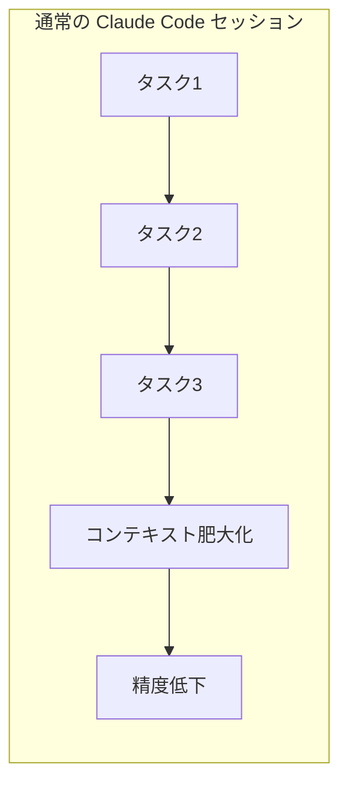
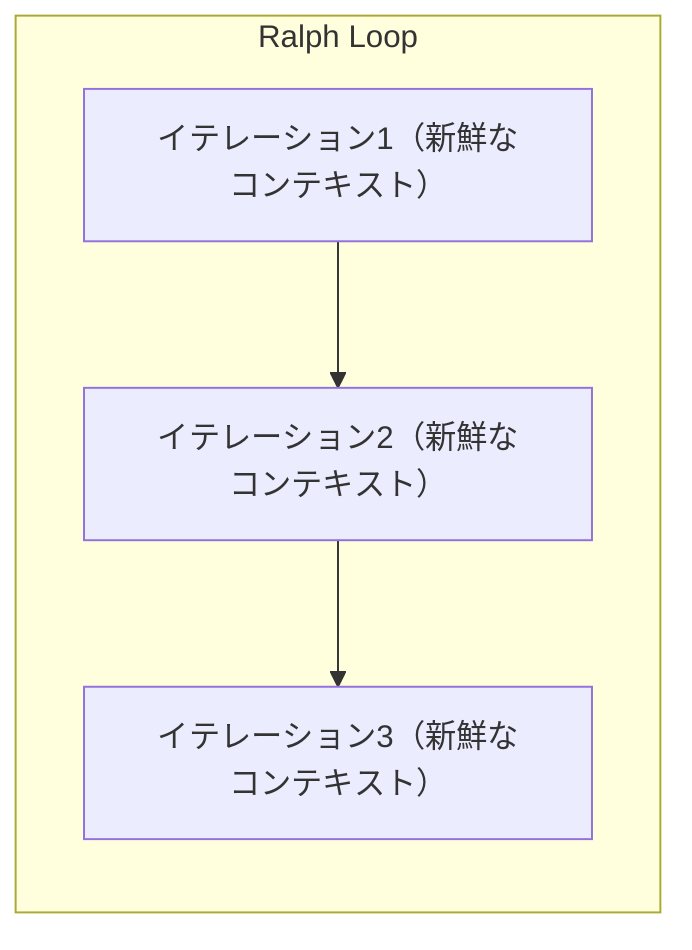
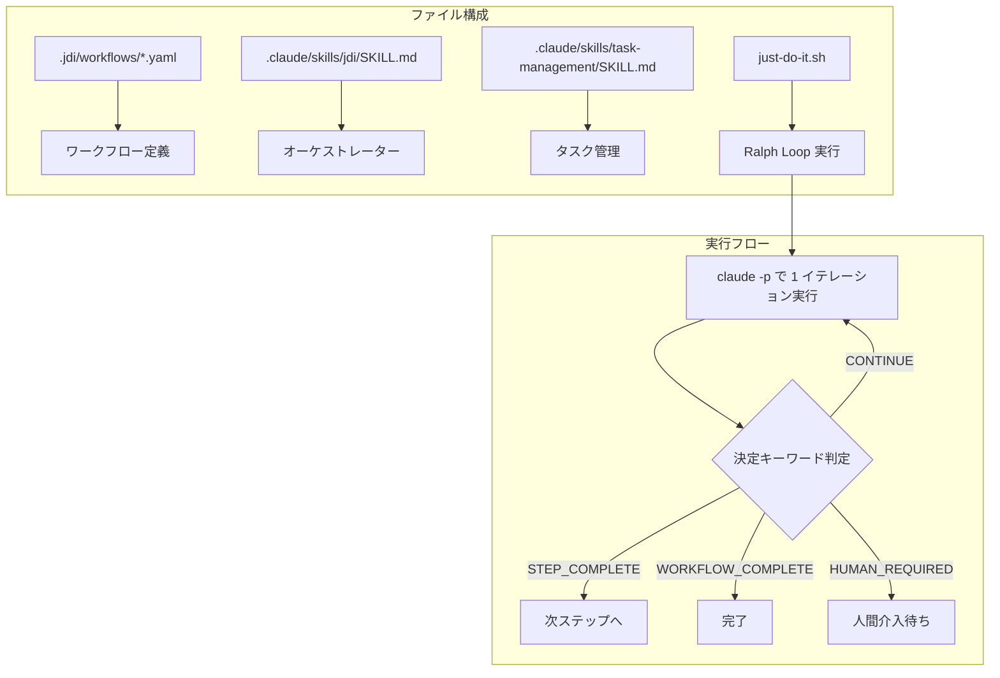
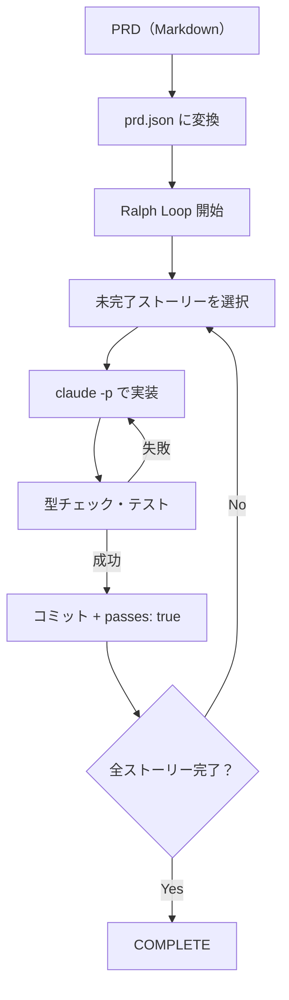
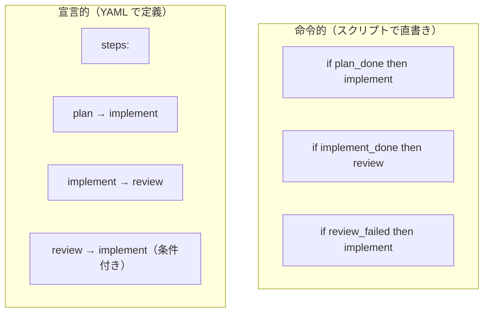

# Claude Code スキルで AI ワークフローを自動化する — Ralph Loop + YAML 宣言的定義の実践

kenfdev さん（[@kenfdev](https://x.com/kenfdev)）が、Claude Code のスキル機能を活用した AI エージェントのワークフロー自動化について、実践的な技術記事を公開しています。

> Claude Code のスキルを中心に、AIエージェントのワークフローを自動化してみた話を書きました。
> bash の while ループで claude -p を繰り返す Ralph Loop と、YAML でワークフロー定義を組み合わせて、plan → implement → review → finalize を自律的に回す仕組みです。
> TAKTほどの精度には及ばないのですが、それなりに自分のワークフローでは活用できています。
>
> — [kenfdev (@kenfdev)](https://x.com/kenfdev/status/2024079025065558483)

記事の核は「Ralph Loop」と「YAML ワークフロー定義」という 2 つの技術を Claude Code スキルで統合し、**plan → implement → review → finalize** を自律的に回す仕組みです。

## Ralph Loop とは何か

### 起源

Ralph Loop（正式には Ralph Wiggum Loop）は、Geoffrey Huntley が考案した AI 開発自動化パターンです。名前はシンプソンズのキャラクターに由来しますが、仕組み自体は極めてシンプルです。

### 基本構造

```bash
while true; do
  result=$(claude -p "プロンプト")
  # 完了判定
  if [[ "$result" == *"COMPLETE"* ]]; then
    break
  fi
done
```

bash の `while` ループで `claude -p`（ヘッドレスモード）を繰り返し呼び出す、たったこれだけです。`-p` フラグは Claude Code を非対話モードで実行し、結果を標準出力に返します。

### なぜループするのか — コンテキストリセットの効果

Ralph Loop の核心は、**毎回のイテレーションでコンテキストがリセットされる**点にあります。





長時間のセッションでは「コンテキスト腐敗（Context Rot）」が発生します。情報が蓄積するにつれ、LLM の出力品質が劣化していく現象です。Ralph Loop はイテレーションごとにコンテキストをリセットすることで、常にフレッシュな状態でタスクに取り組めます。

### 状態の引き継ぎ方

コンテキストがリセットされても、作業の進捗は以下の方法で引き継がれます。

| 引き継ぎ手段 | 内容 |
|-------------|------|
| **Git 履歴** | コミットされたコード変更 |
| **progress.txt** | 各イテレーションの学習内容・発見 |
| **prd.json** | タスクの完了状態（passes: true/false） |

これは前回の Gist で解説した「ハーネスのコンテキスト管理」の Offload 原則そのものです。揮発するコンテキストウィンドウから、永続的なファイルシステムへ状態を退避しています。

## kenfdev 氏の「Just Do It」スキル

### 全体像

kenfdev 氏の記事で紹介されている「Just Do It」（jdi）スキルは、Ralph Loop を YAML ワークフロー定義と組み合わせた自動化システムです。



### YAML ワークフロー定義

ワークフローを YAML で宣言的に定義する点が、単純な Ralph Loop との大きな違いです。

```yaml
name: blog-workflow
initial_step: plan
steps:
  - name: plan
    description: 記事の構成を計画する
    goto: implement

  - name: implement
    description: 記事を執筆する
    goto: review

  - name: review
    description: 記事をレビューする
    if:
      - condition: 修正が必要
        goto: implement    # ← 戻りループ
    goto: finalize

  - name: finalize
    description: 最終確認と公開
    human: true            # ← 人間介入ステップ
    goto: complete
```

この定義から読み取れるポイントは 3 つあります。

1. **宣言的なステップ定義**: 各ステップの「何をするか」と「次にどこへ行くか」を分離して記述します
2. **条件分岐**: `if` で条件付きの遷移を定義でき、review → implement のような戻りループも自然に表現できます
3. **人間介入ポイント**: `human: true` で自動実行を一時停止し、人間の判断を挟むステップを明示的に定義できます

### 決定キーワードの仕組み

ステップ間の遷移は、Claude の出力に含まれる **決定キーワード** で制御されます。

```html
<!-- DECISION: STEP_COMPLETE -->
```

この HTML コメント形式のキーワードを Claude が出力すると、Ralph Loop のスクリプトがそれを検知して次のアクションを決定します。

| キーワード | 意味 |
|-----------|------|
| `CONTINUE` | 同じステップ内で処理を継続 |
| `STEP_COMPLETE` | 現在のステップを完了し、次のステップへ遷移 |
| `WORKFLOW_COMPLETE` | ワークフロー全体の完了 |
| `HUMAN_REQUIRED` | 人間の介入が必要 |

複数の決定キーワードが出力された場合は、**最後のもの**が採用されます。

### タスク管理: Beads の採用

jdi スキルでは、タスク管理に [Beads](https://zenn.dev/ncdc/articles/3cbe9a0d0dd988) という Git ネイティブのタスク管理ツールを採用しています。

Claude Code には組み込みのタスク管理機能（Tasks System）がありますが、jdi ではあえて Beads を選んでいます。その理由は以下の通りです。

| 項目 | Claude Code Tasks | Beads |
|------|------------------|-------|
| 永続性 | セッション内 | Git リポジトリに永続化 |
| AI エージェントとの親和性 | 高い | 高い（CLI ベースで `bd` コマンド） |
| セッション間の引き継ぎ | 限定的 | Git に記録されるため完全 |
| タスク間の依存関係 | サポート | サポート（ブロッカー管理） |

Ralph Loop はイテレーションごとにコンテキストがリセットされるため、セッションを跨いで永続化される Beads のほうが適しています。

タスクタイトルにステッププレフィックス（`[plan]`、`[implement]`、`[review]`）を付与し、オーケストレーターがプレフィックスから現在のステップを判定する仕組みです。

## TAKT との比較

kenfdev 氏がツイートで言及している [TAKT](https://github.com/nrslib/takt) は、より本格的な AI エージェントオーケストレーションフレームワークです。

### TAKT の特徴

TAKT は「指揮者がオーケストラを統制するビート」という音楽メタファーに基づいています。

| 概念 | TAKT での名称 | 説明 |
|------|-------------|------|
| ワークフロー | **Piece**（楽曲） | 全体の作業フロー |
| ステップ | **Movement**（楽章） | 個別の作業ステップ |
| ペルソナ | **Persona** | Agent の役割定義 |
| プロンプト管理 | **Faceted Prompting** | ペルソナ・ポリシー・知識・指示を独立管理 |

### TAKT のワークフロー定義

```yaml
name: plan-implement-review
initial_movement: plan
max_movements: 10

movements:
  - name: plan
    persona: planner
    edit: false
    rules:
      - condition: Planning complete
        next: implement

  - name: implement
    persona: coder
    edit: true
    rules:
      - condition: Implementation complete
        next: review

  - name: review
    persona: reviewer
    edit: false
    rules:
      - condition: Approved
        next: COMPLETE
      - condition: Needs fix
        next: implement
```

### jdi と TAKT の比較

| 項目 | jdi (Just Do It) | TAKT |
|------|-----------------|------|
| **設計思想** | シンプルなスキル拡張 | 本格的なオーケストレーションフレームワーク |
| **ワークフロー定義** | YAML（独自形式） | YAML（独自形式、Faceted Prompting 対応） |
| **並列実行** | 非対応 | Git worktree による並列開発 |
| **ペルソナ管理** | なし（単一 Agent） | Movement ごとに異なるペルソナ |
| **権限制御** | なし | Movement ごとに edit 権限を制御 |
| **遷移制御** | HTML コメントキーワード | AI による条件評価 |
| **タスク管理** | Beads | 独自の tasks.yaml |
| **CI/CD 統合** | なし | GitHub Actions 対応 |
| **導入コスト** | 低い（スキルファイルのみ） | 中程度（CLI インストール + 設定） |
| **精度** | LLM 解釈依存 | 構造的なガードレール付き |

kenfdev 氏が「TAKT ほどの精度には及ばない」と述べている理由は、主にペルソナ分離と権限制御の有無に起因します。TAKT では review ステップの Agent に edit 権限を与えないことで、「レビュアーが勝手にコードを修正する」事故を構造的に防げます。

## Ralph Loop の応用パターン

### オリジナルの Ralph（PRD 駆動型）

[snarktank/ralph](https://github.com/snarktank/ralph) は、PRD（Product Requirements Document）を JSON 化し、ストーリー単位で完了を追跡するパターンです。



### jdi（YAML ワークフロー駆動型）

kenfdev 氏の jdi は、PRD ではなく YAML ワークフロー定義でステップを管理するパターンです。PRD 駆動が「何を作るか」のリスト管理なら、YAML ワークフロー駆動は「どう進めるか」のプロセス管理です。

### 使い分けの指針

| パターン | 適した場面 |
|---------|-----------|
| **PRD 駆動（Ralph）** | 機能実装。ストーリーのリストを消化していく作業 |
| **ワークフロー駆動（jdi）** | プロセスが定型化された作業。ブログ執筆、コードレビュー、リリース準備など |
| **オーケストレーション（TAKT）** | チーム開発。複数ペルソナの協調、並列実行、CI/CD 統合が必要な場面 |

## Claude Code ヘッドレスモード (`-p`) の基本

Ralph Loop の基盤となる Claude Code のヘッドレスモードについて整理します。

### 基本的な使い方

```bash
# 単発実行
claude -p "このリポジトリのREADMEを要約して"

# パイプ入力
cat src/utils.ts | claude -p "TypeScript の型を追加して"

# Git diff のレビュー
git diff | claude -p "このdiffをレビューして"
```

### 出力フォーマット

| フォーマット | 用途 |
|-------------|------|
| `--output-format text` | 人間が読むテキスト（デフォルト） |
| `--output-format json` | プログラムで解析する JSON |
| `--output-format stream-json` | ストリーミング処理 |

### セッション ID による状態維持

```bash
# 同じセッション ID で文脈を維持
claude -p "Step 1: 設計を考えて" --session-id my-session
claude -p "Step 2: 実装して" --session-id my-session
```

`--session-id` を使うと、Ralph Loop のコンテキストリセットとは逆に、文脈を維持したまま複数回の呼び出しが可能です。用途に応じて使い分けます。

## 宣言的ワークフロー定義のメリット

jdi や TAKT が採用する「YAML でワークフローを定義する」アプローチは、2026 年の AI エージェント開発における重要なトレンドです。

### 命令的 vs 宣言的



| 項目 | 命令的 | 宣言的 |
|------|-------|-------|
| 可読性 | ロジックがスクリプトに埋まる | YAML を見ればフローが分かる |
| 再利用性 | コピー＆修正 | テンプレートとして共有可能 |
| バージョン管理 | diff が読みにくい | YAML の diff は明快 |
| エラー処理 | 個別に書く必要がある | 遷移ルールで宣言的に定義 |

### 実践的な効果

kenfdev 氏は、この仕組みを使って**記事の執筆自体をワークフローで自動化**しています。plan（構成計画）→ implement（執筆）→ review（レビュー）→ finalize（最終確認）というフローを YAML で定義し、jdi で実行することで、記事の骨格から仕上げまでを Claude Code が自律的に進めます。

`human: true` フラグを finalize ステップに設定することで、最終確認だけは人間が行う設計です。

## まとめ

- **Ralph Loop** は bash の `while` ループで `claude -p` を繰り返すシンプルなパターンで、コンテキストリセットにより安定した出力を維持できる
- **jdi スキル** は Ralph Loop に YAML ワークフロー定義を組み合わせ、plan → implement → review → finalize を宣言的に定義して自律実行する仕組み
- **決定キーワード**（`CONTINUE` / `STEP_COMPLETE` / `WORKFLOW_COMPLETE` / `HUMAN_REQUIRED`）で、ステップ間の遷移を制御する
- **TAKT** はより本格的なオーケストレーションフレームワークで、ペルソナ分離・権限制御・worktree 並列開発・Faceted Prompting を提供する
- **PRD 駆動（Ralph）** と **ワークフロー駆動（jdi）** は用途が異なり、機能実装 vs プロセス自動化で使い分ける
- **宣言的ワークフロー定義**は、可読性・再利用性・バージョン管理の面で命令的アプローチに優る
- **Beads** を使った Git ネイティブのタスク管理により、セッションを跨いだ状態永続化を実現している

## 参考

- [kenfdev さんのツイート](https://x.com/kenfdev/status/2024079025065558483)
- [AI エージェントのワークフローをスキルで自動化する — Just Do It! (Zenn)](https://zenn.dev/kenfdev/articles/e27d49b8dc12e4)
- [TAKT - Agent Koordination Topology (GitHub)](https://github.com/nrslib/takt)
- [snarktank/ralph - 自律 AI 開発ループ (GitHub)](https://github.com/snarktank/ralph)
- [Run Claude Code programmatically - Claude Code Docs](https://code.claude.com/docs/en/headless)
- [Beads - AI 時代の Git ベースタスク管理ツール (Zenn)](https://zenn.dev/ncdc/articles/3cbe9a0d0dd988)
- [The Ralph Loop: How a Bash Script Is Forcing Developers to Rethink Context as a Resource](https://www.ikangai.com/the-ralph-loop-how-a-bash-script-is-forcing-developers-to-rethink-context-as-a-resource/)
- [Ralph Loops: What Most Developers Get Wrong (Medium)](https://medium.com/vibe-coding/everyones-using-ralph-loops-wrong-here-s-what-actually-works-e5e4208873c1)
