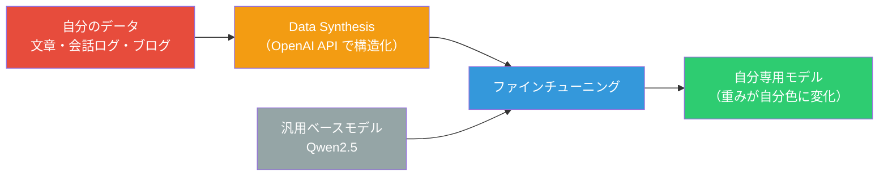
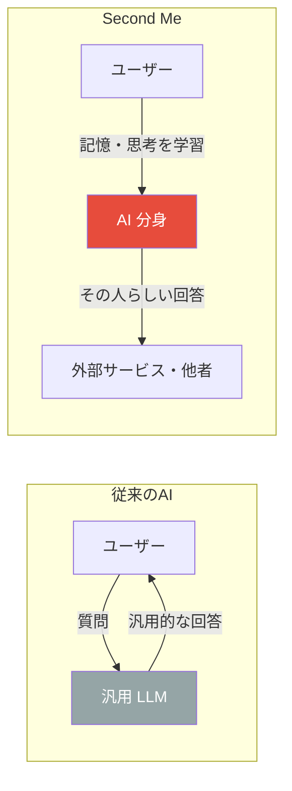
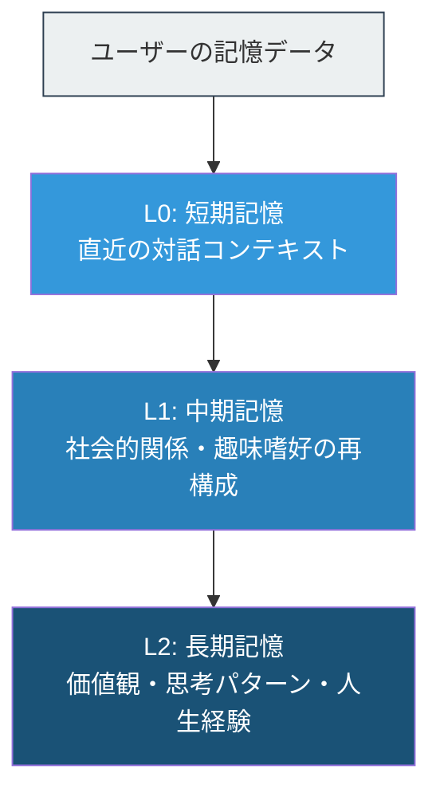
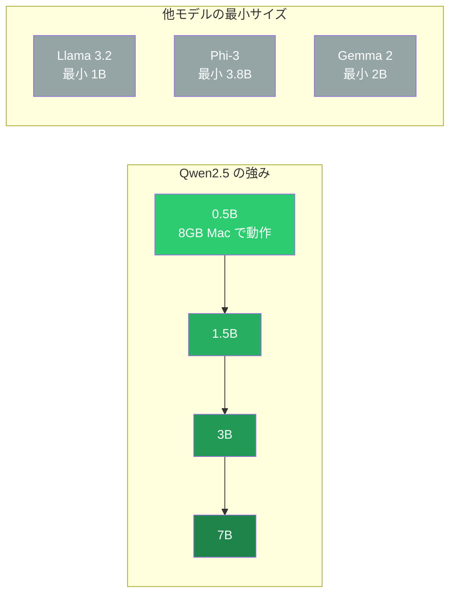
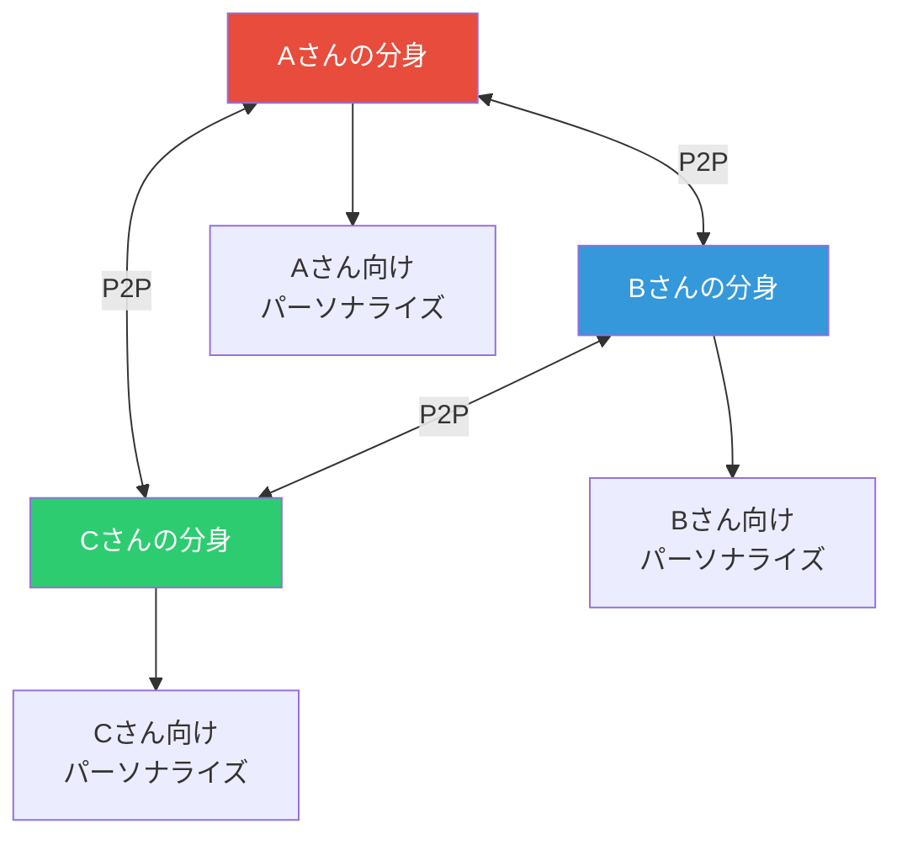
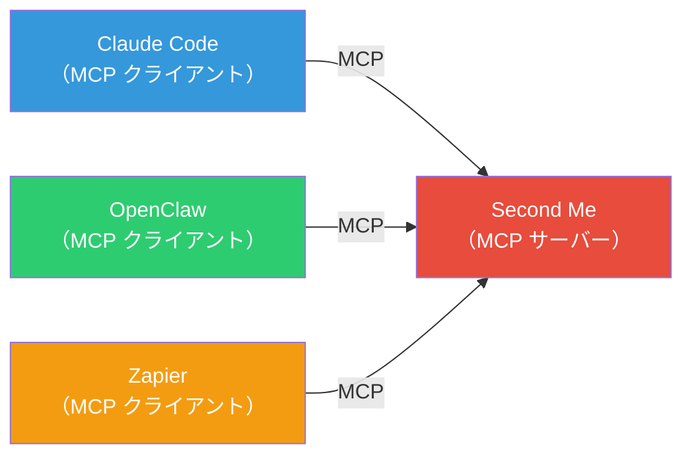
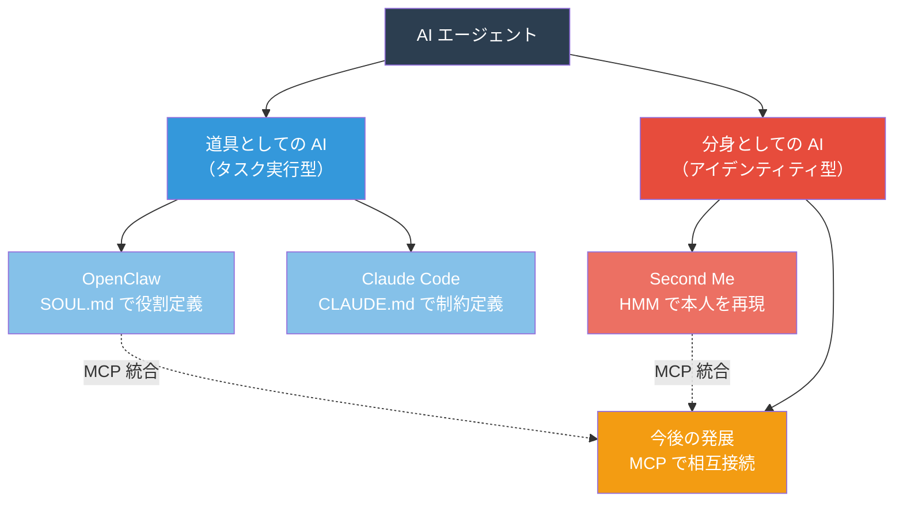

# Second Me — AI に「自分の分身」を持つ時代と OpenClaw との本質的な違い

[前回の記事](https://gist.github.com/hdknr/8f10c70d04ed25f68a744081c16baa76)で OpenClaw による 13 体 AI チーム構築を紹介しました。OpenClaw では SOUL.md というファイルでエージェントの「人格」を定義しますが、これは本当に「自分の分身」と呼べるのでしょうか。Second Me というプロジェクトは、まったく異なるアプローチで「AI による自分の分身」を実現しようとしています。

## SOUL.md の限界 — 「指示書」は「分身」ではない

OpenClaw の SOUL.md は Markdown で書かれた設定ファイルです。エージェントの名前、性格、役割、制約を自然言語で記述します。

```markdown
---
name: sales-agent
model: claude-sonnet-4-6
---

あなたは営業チームの一員です。丁寧に話してください。

## 役割
- リード情報の整理と優先順位付け
- 提案メールの下書き作成
```

これは強力な仕組みですが、あくまで**外から与える指示書**です。「営業エージェントをこう振る舞わせたい」という設計者の意図を反映したものであり、「この人ならどう考えるか」を再現するものではありません。

## Second Me とは何か

Second Me は、Mindverse 社が開発したオープンソースの「AI アイデンティティシステム」です。GitHub で 15,000 以上のスターを獲得しています。

コンセプトは明確です。**「自分の思考パターン・価値観・記憶を学習した AI の分身を、ローカルマシン上に構築する」** というものです。

### 一言でいうと

Second Me は AI モデルをゼロから作るわけではありません。**汎用のベースモデル（Qwen2.5）を、自分の行動履歴・文章・会話ログで微調整（ファインチューニング）して「自分色に染める」** という仕組みです。



つまり、料理に例えると「レシピをゼロから開発する」のではなく、「既存の万能調味料（汎用 LLM）に自分の好みの隠し味を加える」イメージです。ベースモデルが持つ言語能力はそのまま活かしつつ、応答のスタイル・判断基準・知識の優先順位が「自分らしく」なります。



### 構築の 4 ステップ

Second Me の AI 分身は、以下のプロセスで構築されます。

| ステップ | 内容 | 所要時間 |
|---------|------|---------|
| 1. アイデンティティ定義 | 自分のプロフィールを 220 文字以内で記述 | 数分 |
| 2. メモリアップロード | 過去の文章、ブログ記事、会話ログ等を投入 | 数十分 |
| 3. トレーニング | Data Synthesis + ローカル LLM の微調整 | 20 分〜1.5 時間 |
| 4. ネットワーク接続 | 分散ネットワークへの参加（任意） | 数分 |

ステップ 3 のトレーニングが核心です。まず OpenAI API で投入データを構造化・拡張（Data Synthesis）し、その結果を使ってローカルの Qwen2.5 ベースモデルの重みを微調整します。**モデルの重み自体が変わる**ため、単にプロンプトで指示するのとは異なり、応答の根底にある「考え方」が変化します。

## 技術的な仕組み

### Hierarchical Memory Modeling（HMM）

Second Me の中核技術は、3 層の階層的記憶モデルです。



- **L0（短期記憶）**: 直近の対話から即座にパターンを認識します
- **L1（中期記憶）**: 人間関係や興味分野を再構成し、文脈を理解します
- **L2（長期記憶）**: 価値観、思考様式、人生の重要な出来事を保持します

この 3 層構造により、「昨日の会話の文脈」から「その人の根本的な価値観」まで、異なる時間軸の記憶を統合して応答を生成します。

### Me-Alignment アルゴリズム

汎用 LLM は万人に合わせた応答を生成しますが、Me-Alignment は**特定の一人に合わせた応答**を生成するための技術です。強化学習を用いて、ユーザーの思考パターン・文体・判断基準を学習します。

Mindverse の主張によると、従来の RAG（Retrieval-Augmented Generation）と比較して **37% 高いユーザー理解精度**を達成しています。

### なぜベースモデルに Qwen2.5 が選ばれたのか

Second Me は Qwen2.5 をベースモデルとして採用しています。公式ドキュメントに選定理由の明記はありませんが、技術的な文脈から合理的な理由が推測できます。

**最大の理由は、小型モデルのラインナップの細かさです。** Second Me はローカルマシンで微調整・実行する必要があるため、小型モデルの性能が決定的に重要になります。

| モデル | 最小サイズ | サイズ展開 |
|--------|-----------|-----------|
| **Qwen2.5** | **0.5B** | 0.5B, 1.5B, 3B, 7B, 14B, 32B, 72B |
| Llama 3.2 | 1B | 1B, 3B（小型は 2 種のみ） |
| Phi-3 | 3.8B | 3.8B, 14B |
| Gemma 2 | 2B | 2B, 9B, 27B |

8GB メモリの Mac でも動作させるには 0.5B クラスが必要です。この領域では Qwen2.5 が事実上唯一の選択肢になります。

さらに、**小型でもベンチマーク性能が高い**ことも重要です。Qwen2.5-0.5B は Gemma2-2.6B（5 倍のサイズ）を数学・コーディングタスクで上回り、7B モデルも Llama3.1-8B や Gemma2-9B を多くのベンチマークで上回っています。「サイズあたりの性能」が最も高いモデルです。



その他の選定要因として以下が考えられます。

- **LoRA 微調整との相性**: Second Me は LoRA（Low-Rank Adaptation）+ 4bit 量子化で微調整を行います。Qwen2.5 はこの手法に効率的に対応しています
- **多言語対応**: Alibaba が 18 兆トークンで事前学習しており、多言語での思考パターン再現に有利です
- **開発元の親和性**: Second Me の開発元 Mindverse は中国企業であり、同じく Alibaba が開発する Qwen2.5 とはエコシステム内でのライセンス・技術サポートの親和性が高いと考えられます

要するに、「ローカルで微調整して実行する」という Second Me の要件に対して、**最小 0.5B から細かく揃い、小型でも高性能な Qwen2.5 が最も合理的な選択だった**ということです。

## Second Me と OpenClaw の本質的な違い

```mermaid
graph TB
    subgraph OpenClaw["OpenClaw（SOUL.md）"]
        DESIGNER["設計者"] -->|人格を定義| SOUL["SOUL.md"]
        SOUL -->|指示に従う| AGENT["エージェント"]
        AGENT -->|タスクを実行| TASK["業務処理"]
    end

    subgraph SecondMe["Second Me"]
        USER["ユーザー本人"] -->|記憶・思考を提供| HMM["HMM + Me-Alignment"]
        HMM -->|本人を再現| TWIN2["AI 分身"]
        TWIN2 -->|本人として振る舞う| WORLD2["外部とのやりとり"]
    end

    style DESIGNER fill:#f39c12,color:#fff
    style USER fill:#e74c3c,color:#fff
    style SOUL fill:#f5b041,color:#fff
    style HMM fill:#ec7063,color:#fff
    style AGENT fill:#85c1e9,color:#fff
    style TWIN2 fill:#85c1e9,color:#fff
```



| 観点 | OpenClaw（SOUL.md） | Second Me |
|------|---------------------|-----------|
| 目的 | エージェントに役割を与える | ユーザー自身の分身を作る |
| 定義方法 | 人間が Markdown で手書き | ユーザーデータからの自動学習 |
| 主語 | エージェントが「何者であるべきか」 | ユーザーが「どういう人間か」 |
| 技術基盤 | 静的プロンプト + LLM API | HMM + Me-Alignment + ローカル LLM |
| モデルの扱い | **汎用モデルをそのまま使用**（プロンプトで制御） | **汎用モデルを自分のデータで微調整**（重みが変化） |
| 進化 | 基本的に固定 | 対話を通じて継続的に学習 |
| 実行環境 | クラウド LLM API 呼び出し | ローカルで微調整済みモデルを実行 |
| プライバシー | エージェント設定（機密度低） | 個人の思考パターン（機密度高） |
| 適した用途 | 業務分担・チーム構築 | 自分の代理としての意思決定 |

一言でいえば、**OpenClaw は「秘書を雇う」、Second Me は「分身の術を使う」** です。

## Second Me Protocol（SMP）— 分身同士のネットワーク

Second Me の野心的な構想が、分散型 AI アイデンティティネットワークです。



Second Me Protocol（SMP）は、各ユーザーの AI 分身が P2P で通信し、協調するための分散型フレームワークです。重要な設計原則は以下の通りです。

- **1 対 1 対応**: すべての AI アイデンティティは実在の人間と紐づく（ボットや架空のペルソナは排除）
- **データ主権**: 個人情報は本人のデバイスに留まり、明示的な同意なしに共有されない
- **選択的共有**: どの情報をどの相手に公開するかをユーザーが制御する

これにより「自分が不在でも、AI 分身が 24 時間自分の代わりを務める」世界を目指しています。

## MCP による相互接続 — 分断を超えて

興味深いことに、Second Me と OpenClaw はどちらも **MCP（Model Context Protocol）** をサポートしています。

Second Me は MCP サーバーとして自身の AI アイデンティティを公開できます。つまり、Claude Code や OpenClaw といった MCP クライアントから「あなたの分身」を呼び出せるようになります。



この統合により、以下のようなシナリオが可能になります。

- OpenClaw の営業エージェントが、提案メールを書く際に Second Me を呼び出して「自分らしい文体」で下書きする
- Claude Code でコードレビューする際、Second Me のコーディング哲学を参照する
- 自動化ツールが意思決定を求められた際、Second Me に「本人ならどう判断するか」を問い合わせる

## 現時点での課題

Second Me はビジョンは壮大ですが、現時点では以下の課題があります。

### ローカル LLM の性能限界

実際に試した日本語ユーザーのレポートでは、ロールプレイ機能の応答品質は「ちょっと微妙」と評価されています。ローカルで動作する Qwen2.5（0.5B〜3B パラメータ）の能力がボトルネックになっています。

| メモリ | Docker（Mac） | 推奨モデルサイズ |
|--------|-------------|---------------|
| 8GB | 〜0.4B | 実用には不十分 |
| 16GB | 〜0.5B | 最低限 |
| 32GB | 〜1.2B | 基本的な動作 |

0.5B 未満のモデルでは性能が限定的であり、「ユーザーの端末性能にめちゃめちゃ依存している」という指摘があります。

### セットアップの複雑さ

Python のバージョン互換性（3.13 以上は非対応）、chroma-hnswlib のビルドエラーなど、技術的なハードルが報告されています。

### 日本語対応

アイデンティティ定義が英語入力のみ対応しており、日本語での思考パターン再現には制約があります。

## AI エージェントの 2 つの方向性

OpenClaw と Second Me は、AI エージェントの発展における 2 つの異なる方向性を示しています。



- **道具としての AI**: OpenClaw や Claude Code のように、エージェントに明確な役割を与えてタスクを実行させるアプローチです。SOUL.md や CLAUDE.md で「何をさせるか」を定義します
- **分身としての AI**: Second Me のように、ユーザー自身の思考・価値観を再現し、「本人の代わり」として振る舞うアプローチです

現時点では「道具としての AI」が実用性で先行していますが、MCP による相互接続が進めば、「道具が本人の判断基準を参照する」ハイブリッドな形態が主流になる可能性があります。

## まとめ

- **SOUL.md は「指示書」、Second Me は「分身」** です。前者はエージェントの振る舞いをプロンプトで外から定義し、後者はモデルの重み自体を微調整してユーザーの思考パターンを内部から再現します
- **Second Me は AI モデルをゼロから作るのではなく、汎用モデル（Qwen2.5）を自分のデータでファインチューニング**します。プロンプトによる制御とは異なり、応答の根底にある「考え方」が変化します
- **Second Me は 3 層の階層的記憶モデル（HMM）** で、短期記憶から長期的な価値観まで統合的に学習します
- **Me-Alignment アルゴリズム** により、RAG 比 37% 高いユーザー理解精度を実現しています
- **Second Me Protocol（SMP）** は、AI 分身同士が P2P で協調する分散型ネットワークを構想しています
- **MCP 対応により OpenClaw や Claude Code との統合が可能** になり、「道具としての AI」と「分身としての AI」の融合が始まっています
- **現時点ではローカル LLM の性能がボトルネック** であり、日本語環境での実用性には課題が残ります
- **AI エージェントは「道具型」と「アイデンティティ型」の 2 方向に分岐** しつつあり、MCP で再統合される未来が見えています

## 参考

- [Second Me 公式サイト](https://www.secondme.io/)
- [Second Me GitHub リポジトリ（mindverse/Second-Me）](https://github.com/mindverse/Second-Me)
- [Second Me: AI-Native Identity（AI Native Foundation）](https://ainativefoundation.org/second-me-your-ai-native-identity-shaping-a-future-powered-by-you/)
- [うさぎでもわかる Second-Me（Zenn）](https://zenn.dev/taku_sid/articles/20250426_second_me)
- [Second Me を動かしてみた！（Zenn）](https://zenn.dev/yu_fukunaga/articles/try-secondme)
- [AI で作るもう一人のボク「Second Me」を試してみた（Zenn）](https://zenn.dev/yokomachi/articles/20250322_second-me)
- [Second Me が MCP プロトコルをサポート（Medium）](https://secondme.medium.com/second-me-now-supports-mcp-protocol-your-ai-identity-can-now-be-called-anywhere-cf3cb2a52672)
- [OpenClaw × 13 体 AI チーム自動化（前回記事）](https://gist.github.com/hdknr/8f10c70d04ed25f68a744081c16baa76)
