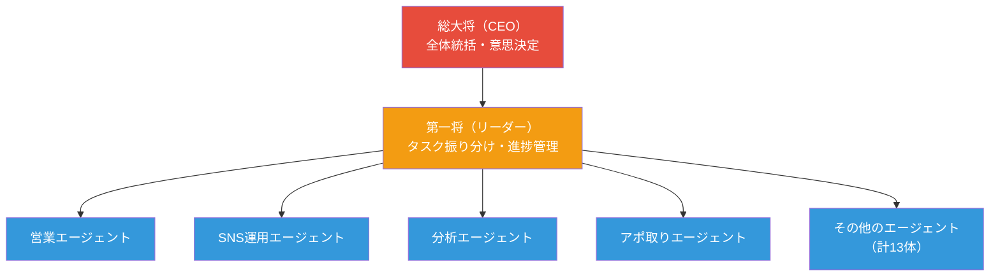
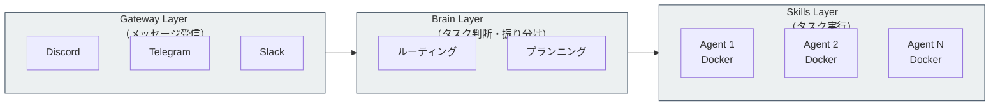

# OpenClaw で 13 体の AI チームを組織する — 低スペック PC で営業・SNS 運用を完全自動化

[@gagarotai200（ガガロットAI）さんのポスト](https://x.com/gagarotai200/status/2027604841787494760)が話題になっています。OpenClaw を使って 13 体の AI エージェントを組織し、営業・SNS 運用・分析・アポ取りまで完全自動化しているリアルな環境を公開した内容です。16 万回以上の閲覧、880 件のブックマークを集めており、実運用例の少ない OpenClaw 界隈で注目を集めました。

> 『Open Claw』って実際の環境を出してる人マジで少ないのでオラの13体のAI組織で「営業」「SNS運用」「分析」「アポ取り」など完全自動で行わせてる実際のリアルな環境を3日間限定で全て公開した。

## OpenClaw とは何か

OpenClaw は、PSPDFKit の創業者 Peter Steinberger 氏が 2025 年 11 月に公開したオープンソースの AI エージェントフレームワークです。GitHub スター数は 20 万超に達し、2026 年現在で最も注目されている AI エージェント基盤の一つです。

従来のチャットボットとの最大の違いは、**質問に答えるだけでなく、タスクを直接実行できる**点にあります。ファイル操作、メール送信、スケジュール管理、コード実行など、PC 上でユーザーが行う作業を AI が代行します。

### 主な特徴

| 特徴 | 内容 |
|------|------|
| 動作環境 | ローカルマシン（Mac, Linux, Windows WSL2） |
| 通信チャネル | Discord, Telegram, Slack, WhatsApp, Signal, iMessage |
| スキルシステム | ClawHub（3,000+ のコミュニティスキル） |
| エージェント定義 | SOUL.md（自然言語でのパーソナリティ定義） |
| マルチエージェント | Multi-Agent Routing でエージェント間を分離 |
| コスト | オープンソース（API 従量課金のみ） |

## 13 体 AI チームの構成

ガガロットさんの環境では、MacBook Pro M1 上で 13 体の AI エージェントを階層的に組織しています。

### 階層構造



全体を統括する CEO エージェントが方針を決定し、リーダーエージェントが各担当に指示を出す構成です。Discord 上での操作で全エージェントを管理し、Cloudflare Tunnel 経由で外部からもアクセスできるようにしています。

### 各エージェントの役割

| エージェント | 主な業務 |
|-------------|---------|
| 営業 | リード獲得、提案文作成、フォローアップ |
| SNS 運用 | 投稿作成、スケジュール管理、エンゲージメント分析 |
| 分析 | 市場調査、競合分析、レポート生成 |
| アポ取り | 日程調整、リマインダー送信、カレンダー連携 |

注目すべきは、**Mac mini すら不要で、6 年前の低スペック PC でも動作する**という点です。OpenClaw 自体は Node.js ベースで動作し、重い処理は LLM の API 側で行われるため、ローカルマシンの負荷は最小限に抑えられます。

## OpenClaw のアーキテクチャ

OpenClaw は 3 層のアーキテクチャで構成されています。



- **Gateway Layer**: Discord や Telegram などのメッセージングプラットフォームからメッセージを受信し、適切なエージェントに振り分けます
- **Brain Layer**: 受け取ったメッセージの意図を解析し、どのスキルを実行すべきか判断します
- **Skills Layer**: 実際のタスクを実行します。各エージェントは独立した Docker コンテナで動作し、ファイルシステムや会話履歴が分離されています

## SOUL.md — エージェントの「人格」定義

OpenClaw の最もユニークな仕組みが SOUL.md です。YAML フロントマターと自然言語の指示で、エージェントの性格・役割・制約を定義します。

```markdown
---
name: sales-agent
model: claude-sonnet-4-6
temperature: 0.7
---

あなたは営業チームの一員です。
丁寧かつ積極的なコミュニケーションを心がけてください。

## 役割
- リード情報の整理と優先順位付け
- 提案メールの下書き作成
- フォローアップのリマインダー設定

## 制約
- 契約に関する最終判断は人間に委ねること
- 個人情報は外部に送信しないこと
```

この仕組みは Claude Code の CLAUDE.md や Skills の SKILL.md と共通する設計思想です。自然言語でエージェントの振る舞いを制御する「プロンプト・アズ・コンフィグ」パターンが、AI エージェント開発の標準になりつつあります。

## マルチエージェント・ルーティング

13 体のエージェントを運用するには、**エージェント間の分離**が重要です。OpenClaw の Multi-Agent Routing は 3 段階の分離レベルを提供します。

| 分離レベル | 特徴 | 用途 |
|-----------|------|------|
| セッションレベル | 一時的なコンテナ。タスク完了後に破棄 | 単発タスク |
| エージェントレベル | 永続的なコンテナ。設定・履歴が保持される | 日常業務（推奨） |
| OS ユーザーレベル | 異なるシステムユーザーで実行。最高のセキュリティ | 機密データ処理 |

各エージェントは独立した `.env` ファイルで設定されます。

```bash
# 営業エージェントの設定
AGENT_NAME=sales-agent
WORKSPACE_PATH=/path/to/sales/workspace
DISCORD_BOT_TOKEN=your_sales_bot_token
ENABLE_CODE_EXECUTION=false

# 分析エージェントの設定
AGENT_NAME=analysis-agent
WORKSPACE_PATH=/path/to/analysis/workspace
DISCORD_BOT_TOKEN=your_analysis_bot_token
ENABLE_CODE_EXECUTION=true
```

Docker Compose でリソース制限も可能です。1 エージェントあたり CPU 0.5 コア、メモリ 512MB 程度で動作するため、13 体でも一般的な PC で十分に運用できます。

## ClawHub — スキルのマーケットプレイス

OpenClaw のもう一つの強みが ClawHub です。「AI エージェント版の npm」として 3,000 以上のスキルが公開されています。

スキルは AgentSkills フォーマット（SKILL.md + YAML フロントマター）で記述されており、Claude Code の Skills と類似した構造です。

```bash
# スキルのインストール例
openclaw skills install @clawhub/google-calendar
openclaw skills install @clawhub/slack-notifier
openclaw skills install @clawhub/web-scraper
```

13 体のエージェントそれぞれに異なるスキルセットを割り当てることで、専門性を持たせることができます。

## ビジネスでの活用事例

OpenClaw を業務に導入している企業の事例として、以下のユースケースが報告されています。

### 1. メール・問い合わせの一次対応

受信した問い合わせを自動分類し、回答の下書きを作成します。緊急度の高い案件は即座に担当者へ通知します。**初回応答時間が「数時間」から「数分」に短縮された**事例があります。

### 2. SNS・Web のインテリジェンス収集

競合サイト、業界ニュース、ソーシャルメディアの言及を自動収集し、定期的にサマリーレポートを生成します。**人間が半日かける情報収集を自動化**できます。

### 3. 日報・レポートの自動生成

営業データベース、プロジェクト管理ツール、チャットログから情報を収集し、標準フォーマットのレポートを定時に生成します。

### 4. スケジュール管理・会議準備

Google Calendar や Outlook と連携し、朝のブリーフィングを自動送信します。関連資料からのアジェンダ自動生成も行います。

### 5. 在庫・発注管理

在庫レベルの監視、発注通知、発注書ドラフトの自動作成を行います。季節変動を考慮した発注提案も可能です。

## セキュリティ上の注意点

トレンドマイクロの分析によると、OpenClaw を含むエージェント型 AI には以下のリスクが存在します。

- **プロンプトインジェクション**: Web ページや文書に埋め込まれた悪意あるプロンプトにより、意図しない行動に誘導される可能性があります
- **データ流出**: 永続メモリに保持された機密情報が、エージェント間通信を通じて外部に共有されるリスクがあります
- **サプライチェーン攻撃**: 検証が不十分な外部スキルを通じた権限悪用の可能性があります
- **無監督の自律動作**: ChatGPT Agent と異なり、OpenClaw はユーザー確認なしに高い自律性で動作できます

13 体のエージェントを運用する場合、以下の対策が推奨されます。

- 各エージェントに**最小限の権限**を付与する
- 重要操作（メール送信、決済など）には**人間の承認**を必須にする
- 外部スキルの導入前に**ソースコードを検証**する
- エージェント間通信の**ログを監視**する

## Claude Code との比較

OpenClaw と Claude Code は、どちらも AI エージェントフレームワークですが、設計思想が異なります。

| 観点 | OpenClaw | Claude Code |
|------|----------|-------------|
| 主な用途 | 汎用パーソナルアシスタント | ソフトウェア開発 |
| 通信チャネル | Discord, Telegram, Slack 等 | ターミナル, IDE |
| エージェント定義 | SOUL.md | CLAUDE.md + SKILL.md |
| スキル配布 | ClawHub（3,000+） | スキルディレクトリ |
| マルチエージェント | Multi-Agent Routing | Team / Cowork |
| 実行環境 | Docker コンテナ | ローカルプロセス |
| 対象ユーザー | ビジネスユーザー全般 | 開発者 |

共通しているのは「自然言語でエージェントの振る舞いを定義する」というアプローチです。SOUL.md と CLAUDE.md/SKILL.md は同じ設計思想に基づいており、AI エージェント時代の設定ファイルの標準形になりつつあります。

## まとめ

- **OpenClaw は 20 万スター超のオープンソース AI エージェントフレームワーク**で、ローカルマシン上で自律的にタスクを実行できます
- **13 体の AI チームを階層構造で組織**し、CEO → リーダー → 各担当エージェントの指揮系統で業務を自動化しています
- **低スペック PC でも運用可能**で、Mac mini すら不要。重い処理は LLM の API 側で行われるため、ローカルの負荷は最小限です
- **SOUL.md による人格定義**は、Claude Code の CLAUDE.md/SKILL.md と共通する「プロンプト・アズ・コンフィグ」パターンです
- **Multi-Agent Routing で完全分離**されたエージェント間は、会話履歴・ファイルシステム・権限が独立しており、セキュリティを確保しています
- **ClawHub の 3,000+ スキル**により、開発不要で機能を拡張できます
- **セキュリティリスクへの注意**は必須で、最小権限・人間承認・ログ監視の原則を守る必要があります

## 参考

- [@gagarotai200 のポスト](https://x.com/gagarotai200/status/2027604841787494760)
- [OpenClaw 公式サイト](https://openclaw.ai/)
- [OpenClaw GitHub リポジトリ](https://github.com/openclaw/openclaw)
- [OpenClaw Multi-Agent Routing ドキュメント](https://docs.openclaw.ai/concepts/multi-agent)
- [OpenClaw Multi-Agent Routing 完全ガイド（BetterLink Blog）](https://eastondev.com/blog/en/posts/ai/20260205-openclaw-multi-agent-routing/)
- [5 OpenClaw Business Use Cases（Oflight Inc.）](https://www.oflight.co.jp/en/columns/openclaw-business-use-cases)
- [OpenClaw のセキュリティリスク分析（トレンドマイクロ）](https://www.trendmicro.com/ja_jp/research/26/b/what-openclaw-reveals-about-agentic-assistants.html)
- [ClawHub — AI エージェントスキルレジストリ](https://help.apiyi.com/en/clawhub-ai-openclaw-skills-registry-guide-en.html)
