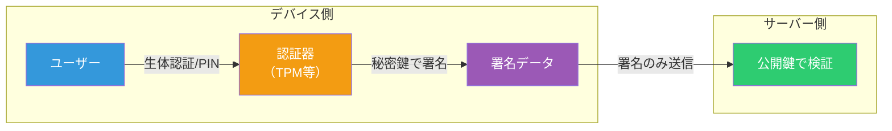
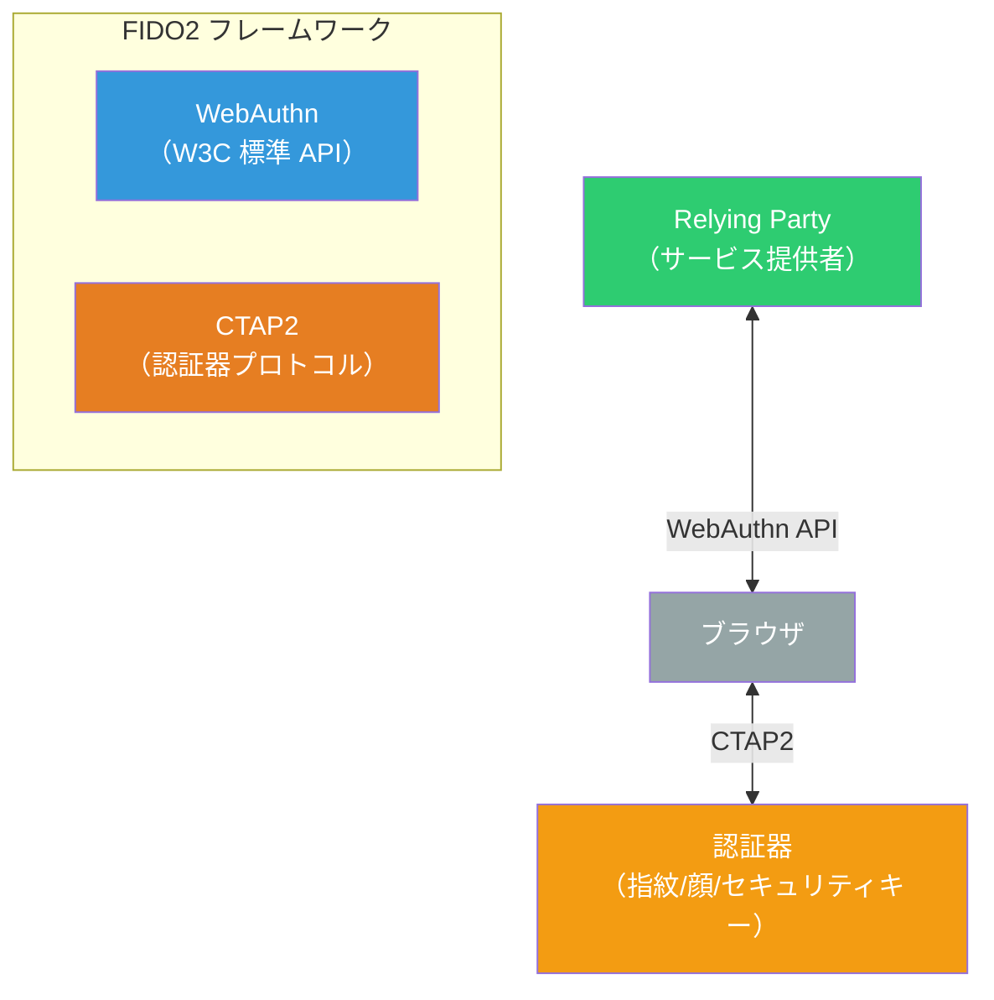
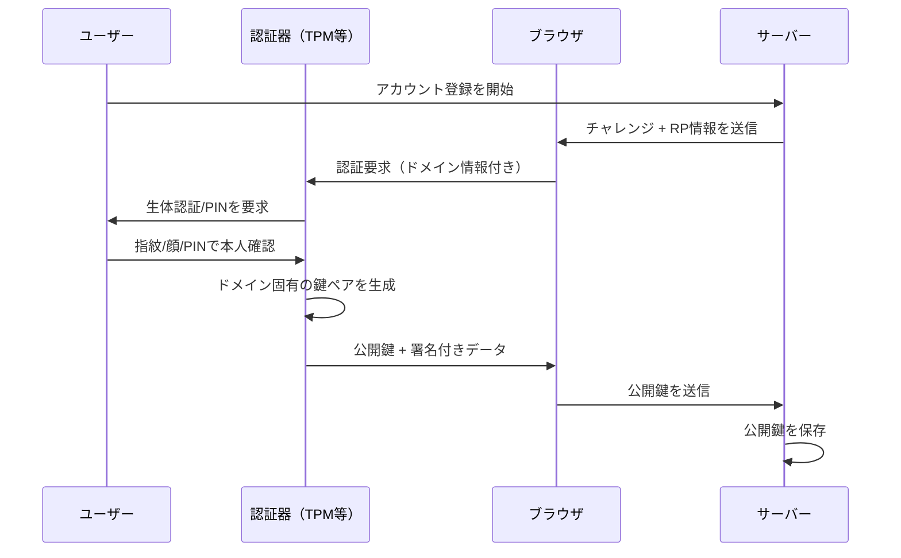
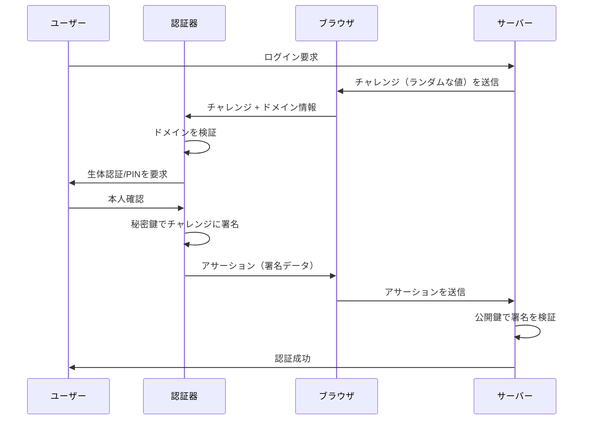
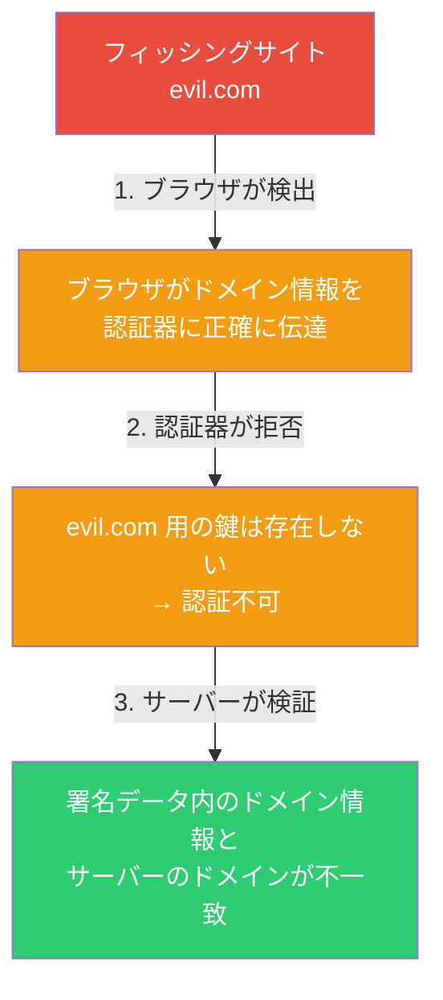

# FIDO2 認証（パスキー）の仕組み — パスワードを「構造的に不要にする」技術

サイボウズのバグバウンティで複数年度 1 位の実績を持つセキュリティ研究者 [@yousukezan さんのポスト](https://x.com/yousukezan/status/2027925123383366044)で紹介されていた、FIDO2 認証（パスキー）の概要記事を深掘りします。元記事は [Nagano さんの Zenn 記事](https://zenn.dev/k_nagano/articles/0fea616a582f01)です。

2026 年現在、日本証券業協会がパスキー（FIDO2）の導入を必須化するガイドラインを施行し、楽天証券・SMBC 日興証券などが相次いで導入を進めています。パスキーはもはや「新しい技術」ではなく「必須のインフラ」になりつつあります。

## パスワード認証の根本的な問題

パスワード認証には、仕組みそのものに起因する構造的な脆弱性があります。


| 脅威 | 内容 |
|------|------|
| フィッシング | 偽サイトにパスワードを入力させる |
| リスト型攻撃 | 漏洩したパスワードを他サービスで試行 |
| 中間者攻撃 | 通信を傍受してパスワードを盗む |
| サーバー侵害 | サーバーに保存されたパスワードハッシュの漏洩 |

これらの問題は「秘密情報（パスワード）をネットワーク経由で送信する」という設計そのものに起因します。ワンタイムパスワード（OTP）でも、この根本構造は変わりません。実際、日本証券業協会は 2025 年 10 月のガイドライン改正で、**OTP の利用を非推奨**としています。

## FIDO2 の設計思想 — 「秘密を送らない」

FIDO2 は発想を根本から変えました。**秘密情報をネットワーク上に一切流さない**認証方式です。



パスワード認証では「秘密そのもの」を送信しますが、FIDO2 では「秘密鍵で作った署名」だけを送信します。秘密鍵はデバイス内の安全な領域（TPM、Secure Enclave 等）に保管され、外部に出ることはありません。

## FIDO2 のアーキテクチャ

FIDO2 は 2 つのプロトコルで構成されています。



| プロトコル | 役割 | 通信区間 |
|-----------|------|---------|
| **WebAuthn** | ブラウザとサーバー間の認証 API（W3C 標準） | ブラウザ - サーバー |
| **CTAP2** | 認証器とブラウザ間の通信プロトコル | 認証器 - ブラウザ |

- **WebAuthn** は Web アプリケーションが公開鍵認証情報を作成・使用するための JavaScript API です
- **CTAP2**（Client to Authenticator Protocol 2）は、USB・NFC・Bluetooth 経由で認証器と通信するためのプロトコルです

## 登録フロー — 公開鍵ペアの生成

パスキーの登録は以下の流れで行われます。



重要なポイントは以下の通りです。

- **秘密鍵はデバイスの外に出ない**: TPM（Trusted Platform Module）や Secure Enclave 内で生成・保管されます
- **鍵はドメインに紐づく**: `example.com` で生成された鍵は `evil.com` では使えません。これがフィッシング耐性の根拠です
- **公開鍵のみサーバーに保存**: サーバーが侵害されても、公開鍵だけでは認証を突破できません

## 認証フロー — チャレンジ・レスポンス

登録後の認証は以下のように行われます。



サーバーが送る「チャレンジ」は毎回異なるランダムな値です。これに秘密鍵で署名を行い、サーバーが公開鍵で検証します。署名データを傍受しても、別のチャレンジには使えないため、**リプレイ攻撃が構造的に不可能**です。

## 3 層のフィッシング防御

FIDO2 がフィッシングに対して「構造的に」強い理由は、3 つの層で防御しているためです。



| 防御層 | 仕組み |
|--------|--------|
| 1. ブラウザ | アクセス中のドメイン情報を認証器に正確に伝達する |
| 2. 認証器 | ドメインに紐づいた鍵のみを提示する（`evil.com` 用の鍵は存在しない） |
| 3. サーバー | 署名データ内のドメイン情報を検証し、不一致なら拒否する |

従来のチャレンジ・レスポンス認証では、中間者がチャレンジを中継すれば突破できました。FIDO2 では**ドメインがプロトコルレベルで暗号的に紐づいている**ため、中継攻撃も構造的に無効化されます。

## パスワード認証との比較

| 観点 | パスワード認証 | FIDO2（パスキー） |
|------|-------------|------------------|
| 送信される情報 | パスワード（秘密そのもの） | 署名データ（秘密は送らない） |
| サーバー保存 | パスワードハッシュ | 公開鍵（漏洩しても無害） |
| フィッシング耐性 | なし | あり（ドメイン紐づけ） |
| リプレイ攻撃 | 可能 | 不可能（チャレンジが毎回異なる） |
| 中間者攻撃 | OTP でも防げない場合あり | 構造的に防御 |
| ユーザー負担 | 記憶・管理が必要 | 生体認証/PIN のみ |

## 日本での導入加速 — 2026 年の現状

### 金融業界の必須化

2025 年 10 月、日本証券業協会は不正アクセス防止のガイドラインを改正し、フィッシング耐性のある多要素認証の導入を求めました。特筆すべきは、**ワンタイムパスワード（OTP）が非推奨**とされた点です。OTP はフィッシングサイトによるリアルタイム中継攻撃に脆弱であり、FIDO2/パスキーが推奨認証方式として明確に位置づけられました。

| 証券会社 | 導入状況 |
|---------|---------|
| SMBC 日興証券 | 2026 年 1 月に富士通のパスキー認証を導入済み |
| 楽天証券 | 2025 年 10 月にパスキー認証を導入済み |
| SBI 証券 | FIDO2 導入を発表 |

### グローバルな普及状況

| サービス | パスキー導入状況 |
|---------|----------------|
| Google | 8 億以上のアカウントでパスキー利用 |
| Amazon | 初年度に 1 億 7,500 万人がパスキー作成 |
| Microsoft | 新規アカウントのデフォルトをパスキーに設定（2025 年 5 月） |
| Apple | iCloud Keychain でデバイス間同期 |

日本では LINE ヤフー、メルカリ、NTT ドコモ、任天堂なども導入を進めており、FIDO Japan Working Group の会員組織は 64 に達しています。

## パスキーの課題と注意点

パスキーは万能ではありません。現時点では以下の課題があります。

### デバイス紛失・故障時のリカバリー

パスキーはデバイスに紐づいているため、デバイスを紛失・故障した場合、そのパスキーは利用できなくなります。パスワードのように「パスワードを忘れた場合」のような単純な復旧プロセスは存在しません。

**対策**: 複数デバイスにパスキーを登録しておく、またはリカバリー手段（SMS 認証等）を併用することが推奨されます。

### エコシステム間の同期制限

パスキーの同期は同じエコシステム内に限られます。Apple なら iCloud Keychain、Google なら Google Password Manager を介して同期されますが、**Apple デバイスで作成したパスキーを Android で直接使う**といったクロスエコシステム同期はできません。

**対策**: 1Password や Bitwarden などのクロスプラットフォーム対応パスワードマネージャーの利用が有効です。

### クラウド同期に伴う新たなリスク

パスキーをクラウド同期すると、デバイス紛失時の復旧は容易になります。一方で、**クラウドアカウントが乗っ取られると同期されたパスキーも危険にさらされる**という新たなリスクが生じます。

### 認証後の攻撃には無防備

FIDO2 は認証プロセスの安全性を保証しますが、認証後のセッション管理は対象外です。セッション Cookie の窃取、アクセストークンのリプレイ、悪意のある OAuth 同意など、**認証後の攻撃には別の対策が必要**です。

## 開発者向け — WebAuthn API の基本

Web アプリケーションにパスキーを実装する際の基本的な API 呼び出しです。

### 登録（Credential Creation）

```javascript
const credential = await navigator.credentials.create({
  publicKey: {
    challenge: new Uint8Array(/* サーバーから受信 */),
    rp: { name: "Example Corp", id: "example.com" },
    user: {
      id: new Uint8Array(/* ユーザーID */),
      name: "user@example.com",
      displayName: "User"
    },
    pubKeyCredParams: [
      { alg: -7, type: "public-key" },   // ES256
      { alg: -257, type: "public-key" }  // RS256
    ],
    authenticatorSelection: {
      authenticatorAttachment: "platform",
      residentKey: "required",
      userVerification: "required"
    }
  }
});
```

### 認証（Assertion）

```javascript
const assertion = await navigator.credentials.get({
  publicKey: {
    challenge: new Uint8Array(/* サーバーから受信 */),
    rpId: "example.com",
    userVerification: "required"
  }
});
```

`residentKey: "required"` を指定することで、Discoverable Credential（パスキー）として登録されます。認証時にユーザー名の入力が不要になり、認証器が自動的に該当する鍵を提示します。

## まとめ

- **パスワード認証の根本的な問題は「秘密を送信する」設計にあり**、FIDO2 は「秘密を送らない」ことで構造的に解決しています
- **FIDO2 = WebAuthn + CTAP2** の 2 層構造で、ブラウザ-サーバー間とブラウザ-認証器間の通信をそれぞれ標準化しています
- **3 層のフィッシング防御**（ブラウザのドメイン伝達 → 認証器のドメイン検証 → サーバーの署名検証）により、フィッシング攻撃を構造的に無効化します
- **日本の金融業界では OTP が非推奨**となり、FIDO2/パスキーへの移行が加速しています。楽天証券、SMBC 日興証券、SBI 証券が導入済みまたは導入予定です
- **Google で 8 億アカウント、Amazon で 1.75 億人**がパスキーを利用するなど、グローバルでも急速に普及しています
- **デバイス紛失時のリカバリーやエコシステム間の同期制限**など課題も残りますが、複数デバイス登録やクロスプラットフォームのパスワードマネージャーで対処可能です
- **認証後の攻撃（セッション窃取等）には別途対策が必要**で、パスキーだけで全てのセキュリティ問題が解決するわけではありません

## 参考

- [@yousukezan のポスト](https://x.com/yousukezan/status/2027925123383366044)
- [FIDO2認証（パスキー）について_概要編（Zenn / Nagano）](https://zenn.dev/k_nagano/articles/0fea616a582f01)
- [Understanding FIDO2, WebAuthn, and Passkeys（Alf Lokken）](https://alflokken.github.io/posts/understanding-fido2-passkeys/)
- [FIDO Alliance — Passkeys](https://fidoalliance.org/passkeys/?lang=ja)
- [パスキーとは — Apple、Google、マイクロソフトが採用する新たな認証の仕組み（トレンドマイクロ）](https://www.trendmicro.com/ja_jp/jp-security/24/e/expertview-20240520-02.html)
- [日本証券業協会 不正アクセス防止ガイドライン（2025 年 10 月）](https://www.jsda.or.jp/houdou/2025/20251015fuseiaccess-guideline.pdf)
- [SMBC日興証券 パスキー認証導入（富士通）](https://global.fujitsu/ja-jp/pr/news/2026/02/02-01)
- [パスキー導入事例 39 社まとめ（CAPY）](https://corp.capy.me/blog/passkey/2025/02/%E6%B5%B7%E5%A4%96%EF%BC%86%E6%97%A5%E6%9C%AC%E3%81%AE%E3%83%91%E3%82%B9%E3%82%AD%E3%83%BC%E5%B0%8E%E5%85%A5%E4%BA%8B%E4%BE%8B38%E7%A4%BE%E3%81%BE%E3%81%A8%E3%82%81%EF%BD%9C%E3%82%BB%E3%82%AD%E3%83%A5/)
- [Passkeys Japan: An Overview 2026（Corbado）](https://www.corbado.com/blog/passkeys-japan-overview)
- [深刻化しているパスワード漏洩における FIDO/パスキーの役割と課題（NEC）](https://jpn.nec.com/fintech/techreport/authentication-report/index.html)
