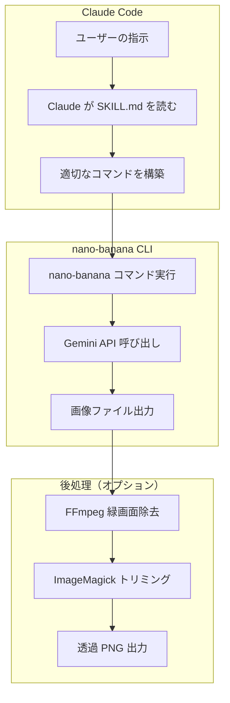
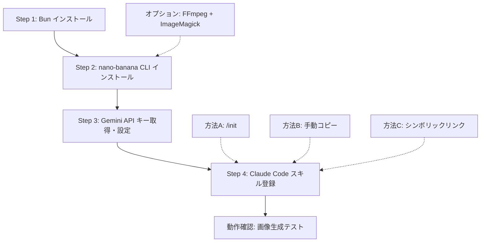
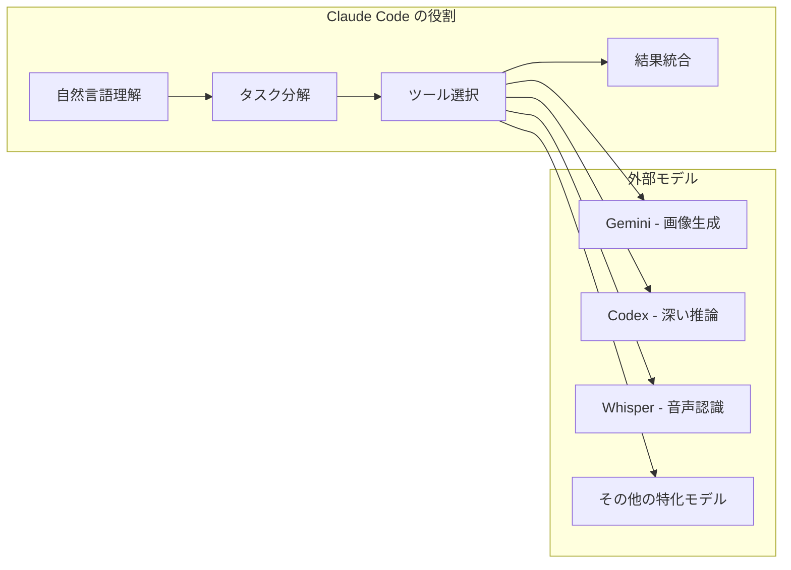
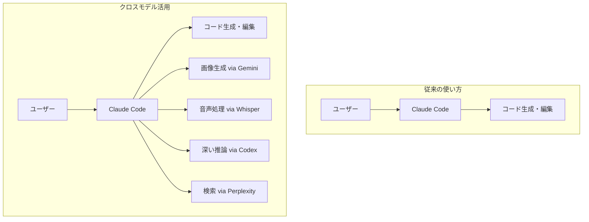

# Claude Code から Nano Banana 2 を呼ぶ — クロスモデル Skills 活用術

鹿野 壮さん（[@tonkotsuboy_com](https://x.com/tonkotsuboy_com)）が、Claude Code から Gemini の画像生成モデル「Nano Banana 2」を直接呼び出せるスキルを紹介しています。

> Nano banana 2をClaude Codeから呼び出せるスキルを見つけた、すごくいい
> Nano bananaのためだけに毎回Geminiアプリを立ち上げる手間が省ける。画像参照とか複雑な命令をしたり、複数枚同時に作れるの便利すぎるブヒィ
>
> — [鹿野 壮 (@tonkotsuboy_com)](https://x.com/tonkotsuboy_com/status/2027988801092714803)

投稿にはいいね 232、ブックマーク 301 と反響が大きく、「AI コーディングツールから別の AI モデルを呼ぶ」というクロスモデル連携への関心の高さがうかがえます。

## Nano Banana 2 とは何か

Nano Banana 2 は、Google DeepMind が 2026 年 2 月 26 日に発表した画像生成モデルです。正式な技術名称は **Gemini 3.1 Flash Image** で、「Nano Banana」は Gemini のネイティブ画像生成機能のブランド名として使われています。

Nano Banana ファミリーには 3 つのモデルがあります。

| モデル | 技術名 | 特徴 |
|--------|--------|------|
| **Nano Banana 2** | Gemini 3.1 Flash Image | 高速・高コスパ。Flash ベースで大量生成向き |
| **Nano Banana Pro** | Gemini 3 Pro Image | 最高品質。プロフェッショナル制作向け |
| **Nano Banana** | Gemini 2.5 Flash Image | 初代。低遅延タスク向け |

Nano Banana 2 の主な機能は以下の通りです。

- **解像度**: 512px から 4K まで対応
- **テキスト描画**: マーケティング素材やインフォグラフィックに使える正確な文字レンダリング
- **Google Search グラウンディング**: リアルタイムデータに基づく画像生成（天気、株価チャートなど）
- **参照画像**: 最大 14 枚の参照画像を組み合わせた生成・編集
- **キャラクター一貫性**: 最大 5 キャラクターの同一性を維持
- **SynthID 透かし**: 全生成画像に AI 生成マークを自動付与

## kingbootoshi/nano-banana-2-skill の仕組み

鹿野さんが紹介しているのは、[kingbootoshi/nano-banana-2-skill](https://github.com/kingbootoshi/nano-banana-2-skill) というオープンソースの Claude Code スキルです。

### アーキテクチャ

このスキルは「CLI ラッパー + Claude Code プラグイン」という二層構造になっています。



ポイントは、Claude Code 自体は画像を「生成」していないことです。Claude はユーザーの自然言語の指示を解釈して、`nano-banana` CLI コマンドを組み立て、Bash で実行します。実際の画像生成は Gemini API が行います。

### セットアップ手順（ステップバイステップ）

以下の 4 ステップで、Claude Code から Nano Banana 2 を呼べるようになります。

#### Step 1: 前提ツールのインストール

まず Bun（JavaScript ランタイム）が必要です。未インストールの場合は以下を実行します。

```bash
# Bun のインストール
curl -fsSL https://bun.sh/install | bash

# 確認
bun --version
```

透過画像の生成（`-t` オプション）を使う場合は、FFmpeg と ImageMagick も必要です。

```bash
# macOS の場合
brew install ffmpeg imagemagick

# Ubuntu/Debian の場合
sudo apt install ffmpeg imagemagick
```

#### Step 2: nano-banana CLI のインストール

リポジトリをクローンし、依存関係をインストールして、コマンドをグローバルに登録します。

```bash
# リポジトリをクローン
git clone https://github.com/kingbootoshi/nano-banana-2-skill.git ~/tools/nano-banana-2

# 依存関係をインストール
cd ~/tools/nano-banana-2
bun install

# グローバルコマンドとして登録（sudo 不要）
bun link
```

`bun link` が失敗する場合は、手動でシンボリックリンクを作成します。

```bash
mkdir -p ~/.local/bin
ln -sf ~/tools/nano-banana-2/src/cli.ts ~/.local/bin/nano-banana
echo 'export PATH="$HOME/.local/bin:$PATH"' >> ~/.zshrc
source ~/.zshrc
```

動作確認として、バージョンが表示されれば OK です。

```bash
nano-banana --help
```

#### Step 3: Gemini API キーの取得と設定

1. [Google AI Studio](https://aistudio.google.com/apikey) にアクセスします
2. Google アカウントでログインします
3. 「Create API Key」をクリックしてキーを生成します（無料）
4. 生成されたキーをコピーします

キーの設定先は `~/.nano-banana/.env` です。

```bash
mkdir -p ~/.nano-banana
echo "GEMINI_API_KEY=AIzaSy..." > ~/.nano-banana/.env
```

> **注意**: API キーは秘密情報です。`.env` ファイルを Git にコミットしないでください。

API キーの解決順序は以下の通りです（上が優先）。

| 優先度 | 設定場所 | 用途 |
|--------|---------|------|
| 1 | `--api-key` フラグ | 一時的に別キーを使う場合 |
| 2 | `GEMINI_API_KEY` 環境変数 | CI/CD 環境など |
| 3 | カレントディレクトリの `.env` | プロジェクト固有の設定 |
| 4 | リポジトリルートの `.env` | 開発環境共通 |
| 5 | `~/.nano-banana/.env` | 個人のデフォルト設定（推奨） |

#### Step 4: Claude Code スキルとして認識させる

nano-banana-2-skill リポジトリには、`plugins/nano-banana/skills/nano-banana/SKILL.md` が含まれています。Claude Code にスキルとして認識させるには、以下のいずれかの方法を使います。

**方法 A: /init コマンド（推奨）**

Claude Code を起動し、以下のように入力します。

```
/init
```

スキルが自動的にセットアップされます。

**方法 B: 手動でスキルディレクトリにコピー**

グローバルスキルとして全プロジェクトで使いたい場合は以下の通りです。

```bash
# グローバルスキルとして配置
mkdir -p ~/.claude/skills/nano-banana
cp ~/tools/nano-banana-2/plugins/nano-banana/skills/nano-banana/SKILL.md \
   ~/.claude/skills/nano-banana/SKILL.md
```

特定プロジェクトだけで使いたい場合は以下の通りです。

```bash
# プロジェクトローカルに配置
mkdir -p .claude/skills/nano-banana
cp ~/tools/nano-banana-2/plugins/nano-banana/skills/nano-banana/SKILL.md \
   .claude/skills/nano-banana/SKILL.md
```

**方法 C: シンボリックリンク（更新に追従したい場合）**

```bash
mkdir -p ~/.claude/skills
ln -sf ~/tools/nano-banana-2/plugins/nano-banana/skills/nano-banana \
   ~/.claude/skills/nano-banana
```

#### 動作確認

Claude Code を起動して、以下のように話しかけます。

```
「テスト用に猫の画像を 512px で生成して」
```

Claude が以下のようなコマンドを組み立てて実行すれば成功です。

```bash
nano-banana "a cute cat, simple illustration" -s 512 -o test-cat
```

生成された画像はカレントディレクトリに保存されます。

#### セットアップ全体の流れ



### コマンドリファレンス

スキルが動作するようになったら、Claude Code に自然言語で依頼するだけですが、内部で組み立てられるコマンドの全オプションを把握しておくと便利です。

| オプション | デフォルト | 説明 |
|-----------|----------|------|
| `-o, --output` | `nano-gen-{timestamp}` | 出力ファイル名（拡張子なし） |
| `-s, --size` | `1K` | 解像度: `512`, `1K`, `2K`, `4K` |
| `-a, --aspect` | モデルデフォルト | アスペクト比: `1:1`, `16:9`, `9:16`, `4:3` 等 |
| `-m, --model` | `flash` | モデル: `flash`/`nb2`（Nano Banana 2）、`pro`/`nb-pro` |
| `-r, --ref` | なし | 参照画像（複数指定可） |
| `-t, --transparent` | 無効 | グリーンスクリーン生成 + 背景除去 |
| `-d, --dir` | カレントディレクトリ | 出力先ディレクトリ |
| `--costs` | - | コスト集計を表示 |

### 使い方

スキルが導入されると、Claude Code に「画像を生成して」と依頼するだけで動作します。

```
# 基本的な画像生成
「猫が宇宙を飛んでいるイラストを生成して」

# 高解像度指定
「16:9 の 4K で、夕焼けの東京タワーの写真を作って」

# 参照画像を使った編集
「この画像の背景を海に変えて」

# 透過 PNG 生成
「ゲーム用のドラゴンのスプライトを透過で作って」
```

Claude が内部的に以下のようなコマンドを組み立てて実行します。

```bash
# 基本
nano-banana "a cat flying through space, illustration style"

# 高解像度 + アスペクト比
nano-banana "Tokyo Tower at sunset, photorealistic" -s 4K -a 16:9

# 透過背景
nano-banana "dragon sprite for game" -t -o dragon_sprite

# 参照画像を使った編集
nano-banana "change background to ocean" -r original.png
```

### 料金

Gemini API の従量課金で、解像度によってコストが変わります。

| サイズ | 解像度 | Flash（Nano Banana 2） | Pro |
|--------|--------|----------------------|-----|
| 512px | 約 512x512 | $0.045 | N/A |
| 1K | 約 1024x1024 | $0.067 | $0.134 |
| 2K | 約 2048x2048 | $0.101 | $0.201 |
| 4K | 約 4096x4096 | $0.151 | $0.302 |

Flash モデル（Nano Banana 2）なら 1 枚 $0.05〜$0.15 程度で生成できます。

## クロスモデル連携という新しいパターン

このスキルが示しているのは、**Claude Code を「オーケストレーター」として、他社の AI モデルを自在に呼び出す**というパターンです。

### なぜ Claude Code が Hub になるのか

Claude Code が他モデルの呼び出し Hub として機能する理由は、次のような構造的な特徴にあります。



- **コンテキスト管理**: Claude Code はプロジェクト全体のコンテキストを保持しているため、「このアプリのアイコンを作って」という曖昧な指示を、具体的なプロンプトに変換できます
- **反復改善**: 生成された画像を Claude が分析し、問題があれば自動で修正プロンプトを作り直せます
- **バッチ処理**: 「100 種類のアプリアイコンを作って」のような大量処理を、ループで自動実行できます

### 実際の活用事例

mkdev.me の記事では、**100 枚以上の iOS アプリアイコン**を Claude Code + Nano Banana Pro で生成し、コスト $45 で完成させた事例が紹介されています。Claude Code の文脈管理能力により、Gemini の Web UI よりも安定した繰り返し作業が可能とのことです。

### 類似のスキル・ツール

Nano Banana 系の Claude Code スキルは複数公開されています。

| リポジトリ | 特徴 |
|-----------|------|
| [kingbootoshi/nano-banana-2-skill](https://github.com/kingbootoshi/nano-banana-2-skill) | Nano Banana 2 対応。透過・参照画像に対応した全部入り |
| [kkoppenhaver/cc-nano-banana](https://github.com/kkoppenhaver/cc-nano-banana) | 軽量版。シンプルな画像生成に特化 |
| [feedtailor/ccskill-nanobanana](https://github.com/feedtailor/ccskill-nanobanana) | Nano Banana Pro 対応 |
| [devonjones/skill-nano-banana](https://github.com/devonjones/skill-nano-banana) | Gemini 3 Pro Image 対応 |
| [kousen/nano-banana-prompt-skill](https://gist.github.com/kousen/f7c66a70cefe90b12c8b5285688a0016) | プロンプト最適化に特化 |

### MCP との違い

外部モデルを呼ぶ方法としては MCP（Model Context Protocol）サーバー経由もあります。

| 項目 | Skills | MCP |
|------|--------|-----|
| セットアップ | SKILL.md + CLI ツール | MCP サーバー起動 |
| 呼び出し方式 | Bash コマンド経由 | プロトコル経由 |
| 柔軟性 | 自然言語でパラメータ調整可能 | 事前定義されたツール呼び出し |
| 適用範囲 | 画像生成、データ処理など幅広い | 外部サービス連携全般 |
| 導入の手軽さ | `git clone` + 数行の設定 | サーバー設定 + 接続設定 |

Skills は「Claude に新しい CLI ツールの使い方を教える」というアプローチで、MCP は「標準プロトコルで外部サービスと接続する」アプローチです。どちらが優れているということではなく、用途によって使い分けます。

## Claude Code Skills の基本構造

このスキルを理解するために、Claude Code Skills の仕組みを確認しておきます。

### SKILL.md の構造

すべてのスキルは `SKILL.md` ファイルを持つディレクトリです。

```
my-skill/
├── SKILL.md          # スキルの定義（必須）
├── references/       # 補足ドキュメント（任意）
│   └── guide.md
└── scripts/          # 実行スクリプト（任意）
    └── generate.py
```

SKILL.md の基本形式は次の通りです。

```markdown
---
name: my-skill
description: スキルの説明。Claude が自動トリガーの判断に使う。
argument-hint: <引数の説明>
---

スキルが呼び出されたときに Claude が従う指示をここに書く。
```

### スキルの配置場所

| 場所 | 適用範囲 |
|------|---------|
| `~/.claude/skills/{name}/` | グローバル（全プロジェクト） |
| `.claude/skills/{name}/` | プロジェクトローカル |

### 自動トリガーと手動呼び出し

- **自動トリガー**: `description` にマッチするフレーズ（「generate an image」など）で自動起動
- **手動呼び出し**: `/skill-name` でスラッシュコマンドとして実行

## 「モデル間コンシェルジュ」としての Claude Code

この Nano Banana スキルの事例は、Claude Code の使い方に新しい視点を提供しています。

従来は「Claude Code = コーディング支援ツール」という認識が主流でしたが、Skills や MCP を活用すると、**他の AI モデルの能力を統合する「コンシェルジュ」** として機能します。



この「コンシェルジュ」モデルには、いくつかの利点があります。

- **ワークフローの統合**: ターミナルを離れずに、コーディング中に画像素材を生成できます
- **コンテキストの共有**: プロジェクトの文脈を理解した上で、適切なモデルに適切な指示を出せます
- **反復の自動化**: 「生成 → 確認 → 修正」のサイクルを Claude Code が自律的に回せます

ただし注意点もあります。

- **API キー管理**: 複数の AI サービスのキーを管理する必要があります。`.env` ファイルの取り扱いには十分注意してください
- **コスト意識**: 各 API の料金体系を理解しておかないと、思わぬ出費になります
- **出力品質の確認**: Claude Code が「良い」と判断しても、人間の目で最終確認は必要です

## まとめ

- **Nano Banana 2** は Google DeepMind が 2026 年 2 月に発表した画像生成モデルで、Gemini 3.1 Flash Image がベース
- **kingbootoshi/nano-banana-2-skill** により、Claude Code から自然言語で Nano Banana 2 を呼び出せる
- **スキルの仕組み**は、Claude が SKILL.md の指示に従い、CLI コマンドを組み立てて Bash 実行するというシンプルな構造
- **クロスモデル連携**により、Claude Code が「コーディングツール」から「AI モデルのオーケストレーター」に進化している
- **Skills と MCP** は外部連携の二大手段で、用途に応じた使い分けが重要
- **実践面**では、API キー管理、コスト管理、出力品質の確認が運用のポイント
- **Nano Banana 系スキル**は複数公開されており、ニーズに合ったものを選べるエコシステムが成長中

## 参考

- [鹿野 壮さんのツイート](https://x.com/tonkotsuboy_com/status/2027988801092714803)
- [kingbootoshi/nano-banana-2-skill (GitHub)](https://github.com/kingbootoshi/nano-banana-2-skill)
- [Nano Banana image generation - Gemini API](https://ai.google.dev/gemini-api/docs/image-generation)
- [Nano Banana 2: Google's latest AI image generation model (Google Blog)](https://blog.google/innovation-and-ai/technology/ai/nano-banana-2/)
- [Build with Nano Banana 2 (Google Developers Blog)](https://blog.google/innovation-and-ai/technology/developers-tools/build-with-nano-banana-2/)
- [Unlimited Image Generation: Nano Banana Pro & Claude Skill (mkdev.me)](https://mkdev.me/posts/unlimited-image-generation-with-nano-banana-pro-and-custom-claude-code-skill)
- [Extend Claude with skills - Claude Code Docs](https://code.claude.com/docs/en/skills)
- [awesome-claude-skills (GitHub)](https://github.com/travisvn/awesome-claude-skills)
- [Claude Code / Codex / Gemini CLI — Skills 機能比較まとめ (Zenn)](https://zenn.dev/hiraoku/articles/e3f750a9fe96dc)
