# AIエージェントの勝負所は「モデル性能」ではなく「ハーネス設計」にある

## はじめに

2026年に入り、AIエージェント開発の世界で急速に広まっている概念がある。**「Agent Harness（エージェント・ハーネス）」** だ。

LLMの性能は日々向上し、Claude Opus 4.6、GPT-5、Gemini 2.5 Pro といったモデルが次々とリリースされている。しかし、現場のエンジニアたちは気づき始めている——**同じモデルを使っていても、エージェントの体感品質はまるで別物になる**ということに。その差を生むのがモデルの「外側」にある仕組み、すなわちAgent Harnessである。

この記事では、[Philipp Schmid](https://www.philschmid.de/agent-harness-2026)のAgent Harness論、[Lance Martin](https://hugobowne.substack.com/p/ai-agent-harness-3-principles-for)のContext Engineering解説、そして[Manus](https://rlancemartin.github.io/2025/10/15/manus/)の実装例を手がかりに、エージェント開発の新しいパラダイムを整理する。

---

## Agent Harness・AIエージェント・LLM の関係

まず、3つの概念の関係を整理する。混乱しやすいのは、これらが**入れ子構造**になっているからだ。

### レイヤー構造

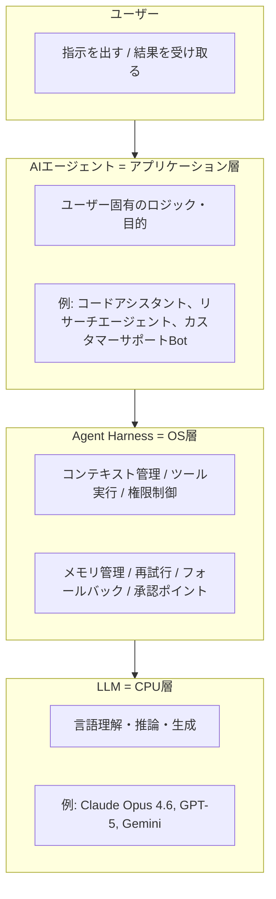

Philipp Schmidのコンピュータの比喩を使うと：

| コンピュータ | AIエージェント | 役割 |
|---|---|---|
| **CPU** | LLM | 処理能力そのもの。賢さの源泉 |
| **RAM** | コンテキストウィンドウ | 作業メモリ。揮発性で容量制限あり |
| **OS** | **Agent Harness** | リソース管理、プロセス制御、I/O |
| **アプリ** | AIエージェント | ユーザーが触れる最終的な製品 |

**重要な点：OSがなければアプリは動かない。** 同様に、Harnessなしではエージェントはまともに動作しない。同じCPU（LLM）を使っていても、OS（Harness）の出来で体感性能が全く変わるのだ。

### エージェントループの実際の流れ

エージェントが1つのタスクを処理する際、内部では以下のループが回っている：

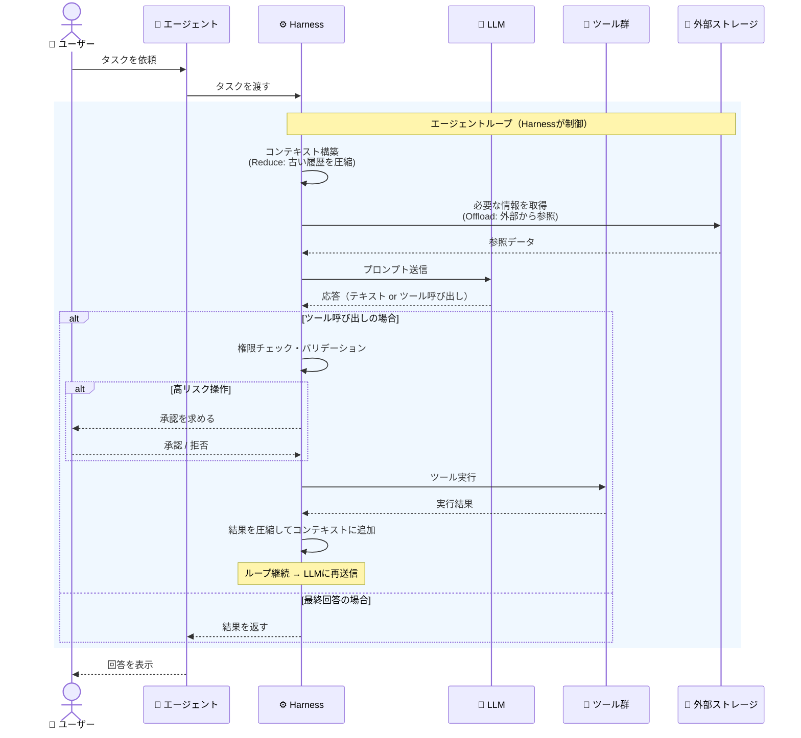

**ここで注目すべきは、LLMは「考える」だけで、Harnessが全ての制御を担っている**ということだ。LLMが「ファイルを読みたい」と言っても、実際にファイルを読む判断・実行・結果の加工はすべてHarnessの仕事だ。

### 3者の責務の違い

```mermaid
graph LR
    subgraph LLM["🧠 LLM の責務"]
        L1[テキスト理解]
        L2[推論・判断]
        L3[テキスト生成]
        L4[ツール選択の提案]
    end

    subgraph Harness["⚙️ Agent Harness の責務"]
        H1[コンテキスト管理]
        H2[ツール実行制御]
        H3[権限・安全管理]
        H4[メモリ管理]
        H5[リトライ・エラー処理]
        H6[サブエージェント管理]
    end

    subgraph Agent["🤖 AIエージェントの責務"]
        A1[ユーザーとの対話]
        A2[タスクの受付・提示]
        A3[ドメイン固有のロジック]
    end

    Agent -->|依存| Harness
    Harness -->|依存| LLM
```

一言でまとめると：
- **LLM** = 「**考える**」（推論エンジン）
- **Agent Harness** = 「**制御する**」（実行基盤・ガードレール）
- **AIエージェント** = 「**使わせる**」（ユーザー向け製品）

### Claude Code ユーザーが体験する各レイヤー

抽象的な3層モデルは、Claude Code を日常的に使っているユーザーにとって「あの画面のあれか」と結びつけると理解しやすい。以下の図は、ユーザーが実際に目にする機能や画面要素を各レイヤーにマッピングしたものだ。

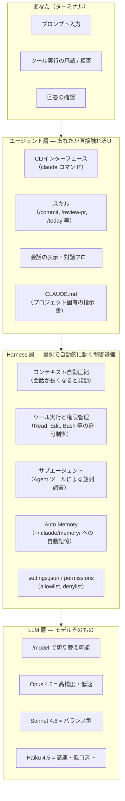

#### 具体的な対応表

普段のClaude Code操作が、どのレイヤーに対応するかを一覧にまとめる。

| あなたの操作・体験 | レイヤー | 役割 |
|---|---|---|
| ターミナルで `claude` を起動する | エージェント | CLIアプリケーションの起動 |
| `/commit` `/review-pr` 等のスキルを使う | エージェント | ドメイン固有のワークフロー |
| `CLAUDE.md` にプロジェクトルールを書く | エージェント | エージェントへの指示書 |
| ツール実行時に「Allow / Deny」を選ぶ | **Harness** | 権限制御・承認ポイント |
| `settings.json` で許可ツールを設定する | **Harness** | ガードレールの設定 |
| 会話が長くなると「messages compressed」と出る | **Harness** | コンテキスト自動圧縮（Reduce） |
| 「Agent: exploring codebase...」と表示される | **Harness** | サブエージェント起動（Isolate） |
| `~/.claude/memory/` に知識が保存される | **Harness** | メモリ管理（Offload） |
| `Read` `Edit` `Bash` 等のツールが実行される | **Harness** | ツール実行制御 |
| `/model` でモデルを切り替える | LLM | 推論エンジンの選択 |
| Opus / Sonnet / Haiku の応答品質の違い | LLM | モデル固有の能力差 |

#### ユーザー体験から見た3原則の発動タイミング

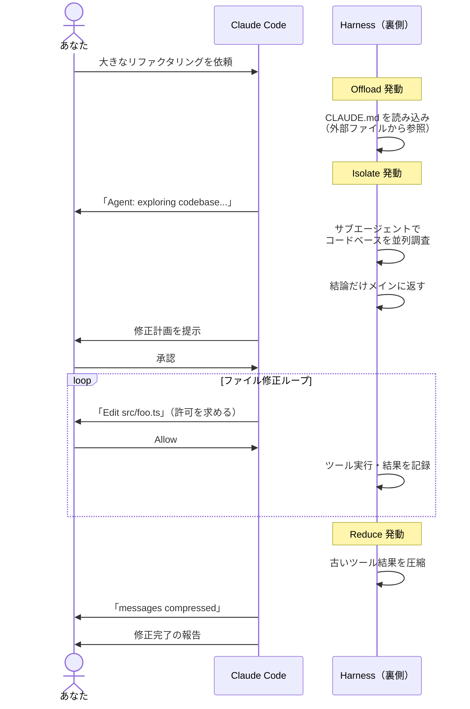

つまり、Claude Code ユーザーはすでに日常的にHarnessの恩恵を受けている。「会話が圧縮された」「サブエージェントが調査している」「ツール実行の許可を求められた」——これらすべてがHarness層の仕事だ。**ユーザーが意識せずとも、Harnessが品質を支えている。**

---

## Harnessの設計思想——Bitter Lesson が教えること

前のセクションで、Harnessがエージェントの品質を左右する重要なレイヤーだと確認した。では、**そのHarnessをどう設計すべきか？** 自然に浮かぶのは「最高のHarnessを作り込もう」という発想だろう。複雑な条件分岐、巧妙なプロンプトハック、精緻なルール体系…。

しかし、ここでAI研究の歴史的教訓が立ちはだかる。

### Bitter Lesson とは

Rich Suttonの「[The Bitter Lesson](http://www.incompleteideas.net/IncIdeas/BitterLesson.html)」は、AI研究における金言だ。**汎用的な計算手法は、最終的には手作りの賢さ（ドメイン知識やヒューリスティクス）を上回る。** チェスAIも画像認識も、人間が組み込んだ知識より、計算量の力押しが勝った。

この教訓がいま、エージェント開発にもそのまま当てはまっている。モデルが急速に賢くなるため、**Harness側に組み込んだ「補助的な賢さ」がすぐ不要になる**のだ。

### 実例：繰り返される「作り直し」

- **Manus**: 2024年3月の公開以降、**5回**アーキテクチャを作り直した
- **LangChain Open Deep Research**: 1年間で**3回**全面再構築
- **Vercel**: エージェントツールの**80%を削除**して性能向上

モデルの進化が速すぎて、今日の最適な設計が半年後には負債になる。作り込むほど、モデル更新のたびに前提が崩れて壊れる。

### パラドックス：「Harnessは重要だが、賢く作ってはいけない」

ここに本セクションの核心がある。

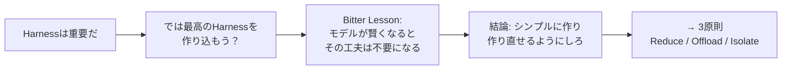

**結論：作り込みより「作り直せる構造」「剥がせる構造」が重要。**

この教訓から導かれる設計原則は3つだ：

1. **Start Simple** — 複雑な制御フローを避け、堅牢な原子的ツールを提供する
2. **Build to Delete** — モジュラーに設計し、いつでもコードを削除できる状態にする
3. **The Harness as Dataset** — 競争優位はプロンプトではなく、実行軌跡（trajectory）の蓄積にある

### 3原則はなぜ「シンプルさ」を志向するのか

Bitter Lesson があるからこそ、この後に続く3原則が「賢さ」ではなく「シンプルさ」を志向している意味がわかる。

| 原則 | 「作り込み」のアプローチ | Bitter Lesson 後のアプローチ |
|---|---|---|
| **Reduce** | 複雑なルールで何を残すか判断 | 閾値を超えたら機械的に圧縮 |
| **Offload** | RAGパイプラインで高度な検索 | ファイルに保存して `grep` で参照 |
| **Isolate** | 精密なタスク分類ロジック | サブエージェントに丸投げして結論だけ受け取る |

右列の「雑に見えるやり方」が勝つのは、モデルが賢くなるにつれて左列の精巧な仕組みが不要になるからだ。**Harnessの仕事は「賢く判断すること」ではなく「シンプルな枠組みを提供すること」**——これが次のセクション以降を読むための前提になる。

---

## Harnessの最大の仕事——コンテキスト管理

Harnessは「シンプルな枠組みを提供する」と述べた。では、そのシンプルな枠組みの中で**最も重要な仕事**は何か？ それが**コンテキストの状態管理**だ。

LLMは与えられたコンテキスト（プロンプト + 過去の会話 + ツール結果）だけを頼りに思考する。つまり、**コンテキストの質 = LLMの判断の質** である。どんなに優れたモデルでも、ゴミだらけのコンテキストを渡されれば、ゴミのような判断しかできない。

コンテキストを「何を入れ、何を捨て、どこに逃がすか」——この管理こそがHarnessの中核的な責務であり、エージェントの品質を直接左右する。

### なぜコンテキストがボトルネックになるのか

しかし、エージェントが長時間タスクを実行すると、ツール結果やログがコンテキストに蓄積され、管理なしでは破綻する。これが引き起こす3つの問題：

1. **コスト増大** — トークン数に比例してAPI費用が膨らむ
2. **レイテンシ悪化** — 長いコンテキストは推論時間を増加させる
3. **品質劣化（Context Rot）** — 100万トークンのコンテキストウィンドウがあっても、情報が増えすぎるとモデルの指示追従が落ち、ノイズに判断が鈍る

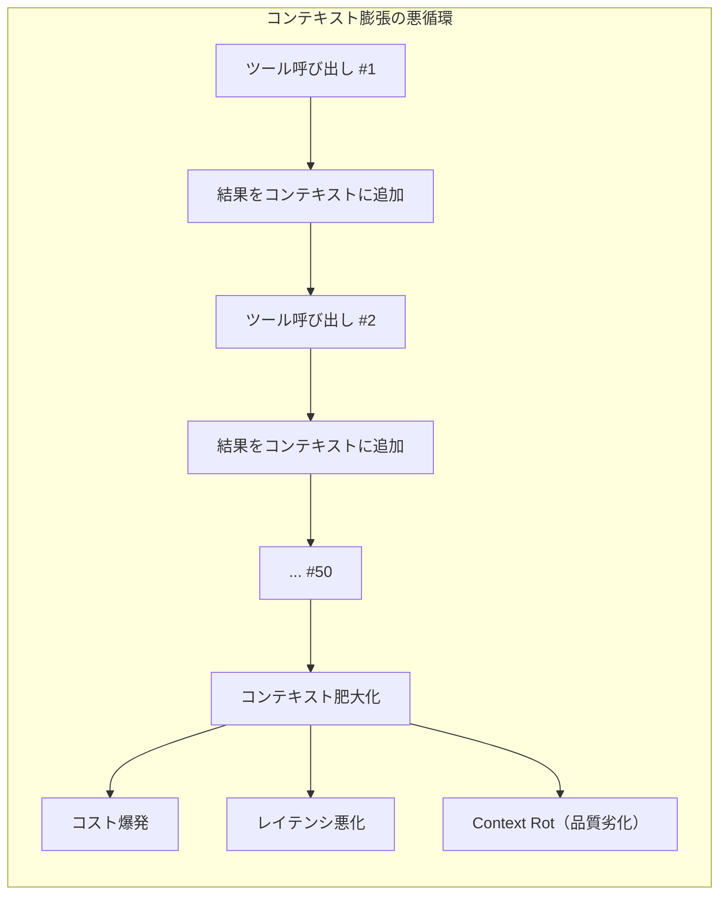

Philipp Schmidは「Pre-Rot閾値」を**256kトークン**に設定することを推奨している。つまり、コンテキストウィンドウの限界まで使おうとしてはいけない。**遥か手前で品質劣化が始まる。**

放置すれば必ず破綻する。だからこそ、Harnessがコンテキストを能動的に管理する必要がある。その具体的な手法が次の3原則だ。

---

## コンテキスト設計の3原則

コンテキスト膨張という問題に対し、Harnessは **Reduce・Offload・Isolate** という3つのシンプルな原則で対処する。「賢く判断する」のではなく「機械的に制御する」——Bitter Lessonの教訓どおりだ。

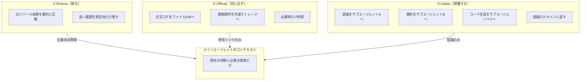

### 原則① Reduce（削る）

**古い情報を要約・圧縮して置き換える。**

- **Compaction（可逆的）**: ツール結果からファイルパスのみを保持し、中身を削除する。必要時に再取得可能
- **Summarization（非可逆的）**: 一定の閾値（例：128kトークン）を超えたら、LLMで過去の履歴を要約に変換。最新のツール呼び出し結果だけは生のまま保持

**狙い：未来の判断に不要な情報を切り落とし、精度と速度を守る。**

Claude Codeでは、会話がコンテキスト制限に近づくと自動的にメッセージを圧縮する仕組みが実装されている。

### 原則② Offload（外に出す）

**プロンプトに詰め込むのではなく、外部に退避する。**

- 全文ログや根拠資料はDB、ファイルシステム、ログサービスに保存
- 必要な時だけ参照する設計にして、常時コンテキストを太らせない
- **ツールは増やしすぎない** — Manusは**20個未満の原子的ツール**に限定

Manusの実装では、ツールを3段階の階層で設計している：
- **Level 1**: `file_write`、`bash`、`search` 等の基本ツール
- **Level 2**: CLI コマンドラップ（`mcp-cli`）
- **Level 3**: コードライブラリの直接実行

Bash のような汎用ツール1つで「行動空間」を確保し、専用ツールを大量に定義してコンテキストを圧迫する設計を避けている。

### 原則③ Isolate（隔離する）

**トークンを大量消費する作業をサブエージェントに切り出す。**

Go言語の並行処理の格言がそのまま当てはまる：**「メモリ共有で通信するな、通信でメモリ共有しろ。」**

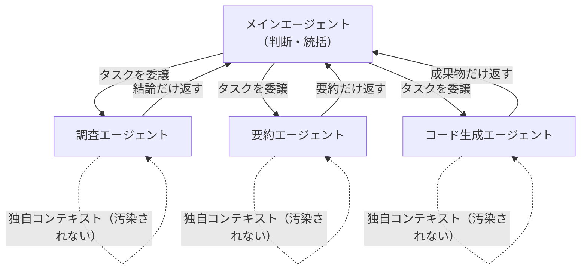

Manusのマルチエージェント構成：
- **プランナー**: タスク割り当てと全体統括
- **知識管理者**: 会話レビューとファイルシステム更新の判定
- **エグゼキューター**: 個別コンテキストを持つサブエージェント

メインエージェントには「結論・判断材料だけ」が返る。調査、要約、コード生成、評価、デバッグなどの重い作業はすべてサブエージェントに委譲される。

**狙い：ノイズ汚染を防ぎ、失敗時の原因切り分けも容易にする。**

---

## エージェント開発の2つの難所

### 難所① 評価と観測（Observability）

AIエージェントの出力は非決定的だ。同じ入力でも異なる結果が返る。これを「どう測って改善するか」が最大の壁になる。

- 既存のベンチマークはシングルターンの出力しか評価できない
- 実運用では「50回目、100回目のツール呼び出し後にモデルがどう振る舞うか」が問題になる
- ベンチマークより、**実運用ログ・失敗パターン**から学ぶ比重が大きい
- 評価設計が弱いと、改善が「気合い」になる

Philipp Schmidは「モデルドリフト」——長時間実行中にモデルの指示追従が劣化する現象——を次のフロンティアと位置づけ、Harnessがモデルの「疲労」を検出する仕組みの必要性を指摘している。

### 難所② 自律性の設計

ワークフロー（手順固定）とエージェント（道筋選択）は連続体上にある。すべてを自律化すると事故が起きる。

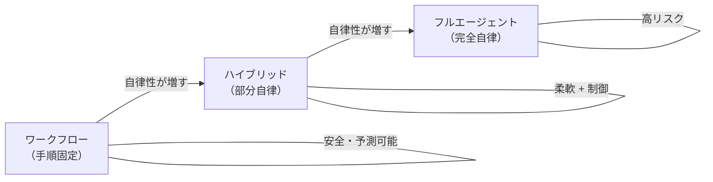

**リスクが高い操作ほど、人間の承認ポイントとフィードバックループが必須だ。**

CNCFの4本柱フレームワークが参考になる：

1. **Golden Paths**: 事前承認済みの構成（承認済みモデル、許可ツール）
2. **Guardrails**: 強制的なポリシー（コスト上限、実行時間制限、ツールホワイトリスト）
3. **Safety Nets**: 自動リカバリ（リトライ、フォールバック、サーキットブレーカー）
4. **Manual Review**: 高リスク判断への人間のゲート

Claude Codeでは、ファイル削除やgit push --forceなど破壊的操作の前にユーザー確認を求める設計がまさにこの思想を体現している。

---

## Claude Code に見るHarness設計の実践

Claude Code は、Agent Harness設計の優れた実践例だ。以下の図は、Claude Code のアーキテクチャをHarnessの観点で整理したものである。

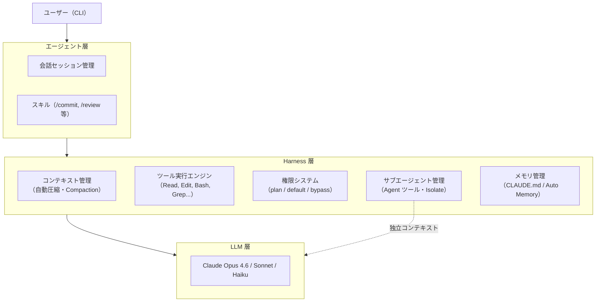

- **Context Compaction（Reduce）**: 会話がコンテキスト制限に近づくと自動でメッセージを圧縮
- **Tool Isolation（Isolate）**: Agent ツールでサブエージェントを起動し、重い調査をメインコンテキストから隔離
- **Atomic Tools（Offload）**: `Read`、`Edit`、`Write`、`Grep`、`Glob` など原子的なツールセット。結果はファイルシステムに存在し、必要時に参照
- **Permission System**: 自律性レベルを段階的に制御（plan mode → default → bypass）
- **Memory Management**: `CLAUDE.md` と Auto Memory による永続的な知識管理

---

## まとめ：賢さを足すより、コンテキストを制御する

2026年のAIエージェント開発で勝負を分けるのは、モデル選択ではない。**モデルの外側にあるHarness設計**だ。

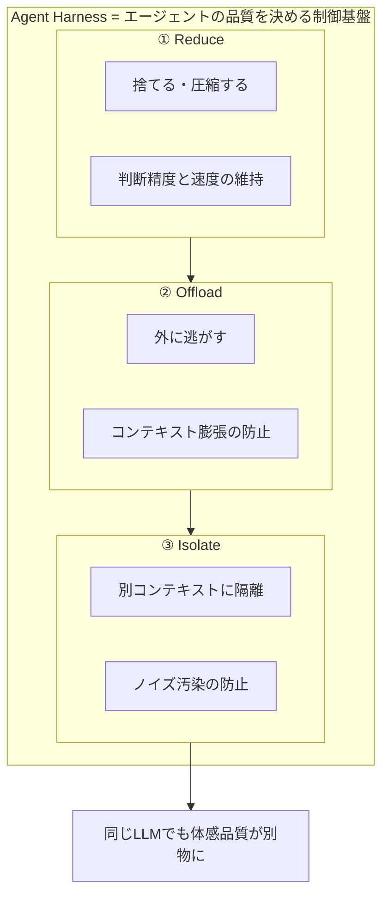

これを前提に、評価で回し、モデル進化に合わせてHarnessを**作り直せる**ようにする。

最大の成果は「複雑さの追加」ではなく「複雑さの削除」から生まれる。Manusチームの言葉を借りれば：

> 「複雑なRAGパイプラインではなく、要素を削除することで性能向上を達成した。」

モデルは明日もっと賢くなる。だからこそ、今日の仕事は「モデルを賢く使う仕組み」ではなく、**「明日作り直せる構造」を設計する**ことにある。

---

## 参考リンク

- [The importance of Agent Harness in 2026 - Philipp Schmid](https://www.philschmid.de/agent-harness-2026)
- [Context Engineering for AI Agents: Part 2 - Philipp Schmid](https://www.philschmid.de/context-engineering-part-2)
- [AI Agent Harness, 3 Principles for Context Engineering, and the Bitter Lesson Revisited - Hugo Bowne-Anderson](https://hugobowne.substack.com/p/ai-agent-harness-3-principles-for)
- [Context Engineering in Manus - Lance Martin](https://rlancemartin.github.io/2025/10/15/manus/)
- [Agent Harnesses: Why 2026 Isn't About More Agents — It's About Controlling Them - DEV Community](https://dev.to/htekdev/agent-harnesses-why-2026-isnt-about-more-agents-its-about-controlling-them-1f24)
- [AIエージェントの性能差のキー、ハーネスエンジニアリング - Seiji Takahashi](https://note.com/timakin/n/nc85957a9f710)
