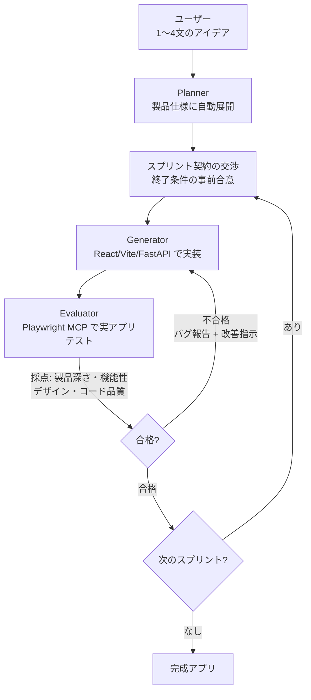

Anthropic の研究者 Prithvi Rajasekaran 氏が、Claude を使ってフルスタックアプリケーションを自律的に構築する「3エージェント・ハーネス」アーキテクチャを公開しました。人間の介入なしに6時間でプレイ可能なゲームエディタを完成させた事例とともに、その設計思想を解説します。

## 「ハーネス設計」とは何か

「ハーネス（harness）」とは、AI モデルを単体で走らせるのではなく、**モデルの外側に構築する制御構造・オーケストレーションロジック全体**を指します。具体的には、どのエージェントがどの順番で何を担当するか（役割分離）、エージェント間でどう情報をやり取りするか（契約の交渉）、いつ次に進みいつやり直すか（判定ループ）、何を使ってテストするか（ツール選択）といった設計要素が含まれます。

モデル自体の性能向上とは別の軸で、この制御層をどう設計するかが自律開発の品質を左右します。

## 背景: AI は自分に甘すぎる

このアーキテクチャが生まれた核心的な課題は、**AI モデルが自分の出力に対して甘い評価をしがちである**という点です。

> 「自分が生成した成果物を評価させると、エージェントは自信を持ってそれを称賛する傾向がある —— 人間の目から見れば明らかに品質が低い場合でさえ」（Rajasekaran 氏）

この問題は、デザインのような正解/不正解が明確でない領域で特に顕著です。コードにおいても、理論上は正しさを検証できるはずですが、AI エージェントは自分のエラーをスルーしてしまいがちです。

解決策として採用されたのが、**GAN（Generative Adversarial Network: 敵対的生成ネットワーク）に着想を得た分離アプローチ** —— 「作る役割」と「評価する役割」を完全に分けるという設計です。

## 3エージェント・アーキテクチャ

最終的なアーキテクチャは以下の3つの専門エージェントで構成されます。

| エージェント | 役割 |
|---|---|
| **Planner** | 1〜4文のアイデアを完全な製品仕様に展開 |
| **Generator** | 機能ごとにスプリント方式で実装 |
| **Evaluator** | 実行中のアプリを Playwright でテスト・採点 |

### Planner: 仕様の自動展開

初期バージョンでは、生のプロンプトを渡すとモデルがタスクを過小評価する問題がありました。十分に考える前にビルドを開始してしまい、機能の薄いアプリが生成されていたのです。Planner はこの問題を解決するために追加されたエージェントで、短いアイデアを詳細な製品仕様に自動展開します。

### Generator: スプリント契約による構造化開発

Generator は React、Vite、FastAPI、SQLite/PostgreSQL のスタックを使い、機能単位のスプリントで実装を進めます。重要なのは、コーディング前に Evaluator と「**スプリント契約**」を交渉する点です。何をもって「完了」とするかを事前に合意するまで、Generator は一行もコードを書き始めません。

### Evaluator: Playwright による実アプリテスト

最大のイノベーションは Evaluator にあります。静的なコードレビューではなく、**Playwright（ブラウザ自動化ツール）を MCP（Model Context Protocol）経由で操作し、実行中のアプリケーションをテスト**します。UI の機能をクリックし、API エンドポイントをテストし、データベースの状態を検証する —— 人間の QA エンジニアと同じ方法です。

各スプリントは以下の4つの基準で採点されます:

- **製品の深さ** — 機能が十分に実装されているか
- **機能性** — 実際に動作するか
- **ビジュアルデザイン** — UI デザインの質
- **コード品質** — コードの保守性・正確性

## デザイン品質の定量化

スプリント評価とは別に、Rajasekaran 氏はまずフロントエンドデザインで Generator-Evaluator ループをテストし、**デザイン専用の評価基準**も定式化しました。Claude はデフォルトで「安全で予測可能なレイアウト」—— 機能的だが視覚的には特徴のないデザインを生成しがちです。

この問題に対して、デザイン品質を4つの評価基準に定式化しました:

1. **デザイン品質** — インターフェース全体の統一感
2. **オリジナリティ** — 意図的なクリエイティブ選択があるか
3. **クラフト** — スペーシング、タイポグラフィ、コントラスト比
4. **機能性** — ユーザーが実際に使えるか

評価基準では、いわゆる「**AI スロップ**」—— 紫のグラデーション、未カスタマイズのストックコンポーネント、ジェネリックなパターンなど、AI がトレーニングデータの分布に引っ張られて生成するデザインを明確にペナルティとしています。

印象的な成果として、オランダの美術館サイトのプロンプトでは、9回の反復を経て Generator が従来型のダークテーマのランディングページを捨て、**CSS パースペクティブを使った3D空間体験** —— 仮想の壁に作品を展示し、ドアウェイ型ナビゲーションでギャラリー間を移動する設計に到達しました。

## 実験結果: ソロ vs. ハーネス

「2Dレトロゲームメーカーを作成せよ」というプロンプトで直接比較が行われました。

| アプローチ | 所要時間 | コスト |
|---|---|---|
| ソロエージェント | 20分 | $9 |
| フルハーネス | 6時間 | $200 |

**ソロ版**は一見機能するように見えましたが、実際にプレイしようとすると壊れていました。ゲーム内のキャラクターやオブジェクト（エンティティ）は画面に表示されるものの入力に反応せず、エンティティ定義とゲームランタイムの配線がサイレントに失敗していました。

**ハーネス版**はプレイ可能でした。物理演算には荒い部分もありましたが、コアループは動作しました。Evaluator は開発中に数十のバグを発見しており、その中には FastAPI のルート定義順序の問題（文字列 "reorder" を整数としてパースしようとするエラー）も含まれていました。

## モデル進化とハーネスの未来

興味深い点として、Claude Sonnet 4.5 から **Opus 4.6 に移行した際、コンテキストリセットが不要になり、スプリント管理を大幅に軽量化できた**とのことです。Sonnet 4.5 では長いコンテキストの中で情報を見失う「コンテキスト不安」が強くリセットが必要でしたが、Opus 4.6 は計画能力が向上し、2時間のビルドを通じて一貫した作業を維持できるようになりました。

ただし Rajasekaran 氏は、モデルが進化してもハーネス設計の重要性は消えないと主張しています。

> 「AI エンジニアにとって興味深い仕事は、次の新しい組み合わせを見つけ続けることだ」

モデルが改善されるにつれてハーネスはより複雑になるのではなく、**有用なハーネス設計の空間が移動する**という見方です。この事例で「有用なハーネス設計」を構成していた具体的な要素を整理すると:

1. **エージェントの役割分離** — 生成と評価を別エージェントに分ける敵対的構造。さらに Planner を追加して「考える前に作り始める」問題を防止
2. **スプリント契約** — コーディング前に Generator と Evaluator が「何をもって完了か」を交渉する終了ルール
3. **評価基準の定式化** — 主観的な「良いデザインか？」を4つの採点基準に落とし込み、「AI スロップ」を明示的にペナルティ化
4. **テスト手段の選択** — 静的コードレビューではなく、Playwright MCP で実際にアプリを操作する動的テスト

モデルが進化すると一部の要素が不要になります（例: Opus 4.6 ではスプリント分解が軽量化された）。しかし同時に、より高度なタスクが可能になることで、**別の新しいハーネス設計が有効になる領域が出てくる** —— これが「空間の移動」の意味です。

## まとめ

このアーキテクチャが示す重要なポイント:

- **自己評価の分離**: 生成と評価を別エージェントに分けることで、AI の「自分に甘い」問題を構造的に解決
- **スプリント契約**: 事前合意による品質基準の明確化
- **実アプリテスト**: 静的解析ではなく Playwright による動的テストで実際の動作を検証
- **スケーラブルな品質**: モデル進化に伴い、ハーネス構造も進化できる柔軟性

コスト（$200）と時間（6時間）はソロ実行より大幅に増えますが、**実際に動作するアプリが完成する**という点で、品質保証付き自律開発の実用的なアプローチと言えます。

## 参考リンク

- [Harness design for long-running application development](https://www.anthropic.com/engineering/harness-design-long-running-apps) — Anthropic 公式エンジニアリングブログ
- [How Anthropic Taught Claude to Build Full Apps — and Grade Its Own Work](https://www.vktr.com/ai-news/anthropic-harness-design/) — VKTR 解説記事
