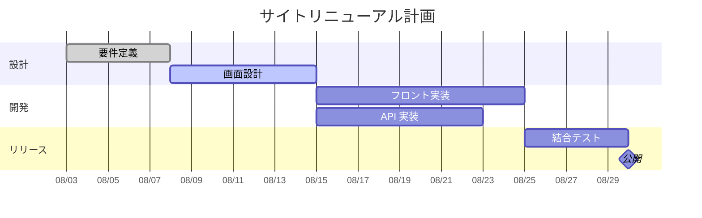

Claude Code にガントチャートを作らせて PNG や SVG にしたいとき、Claude に直接画像を描かせることはできません。いったんテキストの「中間ファイル」を書かせ、それを CLI ツールで画像に変換する、という 2 段構えになります。

では、その中間ファイルは何の形式にするのがよいのか。見るべき観点は 2 つです。

- AI が書きやすいか（構文が単純で、生成エラーが少ないか）
- CLI で画像に変換しやすいか（コマンド 1 つで PNG / SVG になるか）

この記事では代表的な 4 つのアプローチについて、同じ「サイトリニューアル計画」を実際に書いて変換し、手順とハマりどころを比べます。結論から言うと、まず試すなら Mermaid と `mmdc` の組み合わせです。依存関係を見せたいなら PlantUML、データを再利用したいなら Vega-Lite が候補になります。

> 検証環境：macOS / mermaid-cli 11.4.2 / PlantUML 1.2026.8 / Vega-Lite 5 系 / CairoSVG 2.9.1

## 1. Mermaid（`.mmd`）：まず試すならこれ

Mermaid はテキストで図を書く記法（DSL）で、ガントチャート専用の構文 `gantt` があります。構文が単純で LLM も書き慣れているため、生成エラーが起きにくいのが利点です。GitHub の Markdown でもそのまま表示されます。

次の内容を `plan.mmd` として保存します。



`after req` のように前のタスクを参照すれば、開始日は自動で計算されます。画像化には `@mermaid-js/mermaid-cli` の `mmdc` コマンドを使います。`npx` で都度実行するか、`npm i -g @mermaid-js/mermaid-cli` でインストールすれば `mmdc` として呼べます。

```bash
npx @mermaid-js/mermaid-cli -i plan.mmd -o plan.svg
npx @mermaid-js/mermaid-cli -i plan.mmd -o plan.png -s 2   # -s で拡大率を指定
```


### ハマりどころ：mmdc の「Could not find Chrome」エラー

`mmdc` は内部で Puppeteer を使い、ブラウザで描画した結果を書き出しています。そのため、Puppeteer 用の Chrome が入っていない環境では次のエラーで止まります。

```text
Error: Could not find Chrome (ver. 131.0.6778.204). This can occur if either
 1. you did not perform an installation before running the script (e.g. `npx puppeteer browsers install chrome-headless-shell`) or
 2. your cache path is incorrectly configured (which is: /Users/hdknr/.cache/puppeteer).
```

エラーメッセージのとおり、Puppeteer 用のブラウザをインストールすれば動きます。すでに Chrome が入っているなら、そのパスを書いた設定ファイル（ここでは `puppeteer-config.json`）を `-p` で渡す方法もあります。

```json
{
  "executablePath": "/Applications/Google Chrome.app/Contents/MacOS/Google Chrome"
}
```

```bash
mmdc -p puppeteer-config.json -i plan.mmd -o plan.png -s 2
```

Claude Code に任せる場合も、このエラーで止まることを想定して、ブラウザの指定方法をあらかじめ指示やスキルに書いておくとスムーズです。

## 2. PlantUML（`.puml`）：依存関係を明示したいとき

PlantUML もテキスト DSL で、ガントチャート用の構文があります。Mermaid より英文に近い書き方で、タスク間の依存関係を明示的に書けます。次の内容を `plan.puml` として保存します。

```text
@startgantt
scale 2
title サイトリニューアル計画
Project starts 2026-08-03
[要件定義] requires 5 days
[画面設計] requires 7 days
[画面設計] starts at [要件定義]'s end
[フロント実装] requires 10 days
[フロント実装] starts at [画面設計]'s end
[API 実装] requires 8 days
[API 実装] starts at [画面設計]'s end
[結合テスト] requires 5 days
[結合テスト] starts at [フロント実装]'s end
[公開] happens at [結合テスト]'s end
@endgantt
```

2 行目の `scale 2` は、出力を 2 倍の大きさにする指定です。

PlantUML は Java で動くので、[公式リポジトリのリリース](https://github.com/plantuml/plantuml/releases) から jar を取得して実行します。`-tsvg` / `-tpng` で出力形式を指定でき、出力ファイルは入力と同じ場所に同じ名前で作られます（現行の `--help` では `--svg` のような書き方も案内されています）。

```bash
java -jar plantuml.jar -tsvg plan.puml   # → plan.svg が生成される
java -jar plantuml.jar -tpng plan.puml   # → plan.png が生成される
```


`starts at [...]'s end` で書いた依存関係が矢印として描かれ、開始日・終了日・期間の表も付きました。マイルストーンや依存関係が多い計画を、図としてきちんと見せたい場合に向いています。

## 3. Vega-Lite（JSON）：データとして扱いたいとき

Vega-Lite は、グラフを JSON で宣言的に記述する可視化の仕様です。ガントチャート専用の構文はありませんが、`bar` マークの `x` に開始日、`x2` に終了日を割り当てれば、横棒のガントチャートになります。

タスクの一覧がそのまま `data.values` の配列になるので、同じデータを集計や別のグラフに使い回せるのが利点です。なお、マイルストーン（公開）は別のマークを重ねる必要があるため、ここでは省いています。

次の内容を `plan.vl.json` として保存します。

```json
{
  "$schema": "https://vega.github.io/schema/vega-lite/v5.json",
  "title": "サイトリニューアル計画",
  "width": 500,
  "padding": {"left": 30, "top": 5, "right": 5, "bottom": 5},
  "data": {
    "values": [
      {"task": "要件定義", "start": "2026-08-03", "end": "2026-08-08"},
      {"task": "画面設計", "start": "2026-08-08", "end": "2026-08-15"},
      {"task": "フロント実装", "start": "2026-08-15", "end": "2026-08-25"},
      {"task": "API 実装", "start": "2026-08-15", "end": "2026-08-23"},
      {"task": "結合テスト", "start": "2026-08-25", "end": "2026-08-30"}
    ]
  },
  "config": {"font": "Hiragino Sans"},
  "mark": "bar",
  "encoding": {
    "y": {"field": "task", "type": "ordinal", "sort": null, "title": null},
    "x": {"field": "start", "type": "temporal", "title": null,
          "axis": {"format": "%m/%d"}},
    "x2": {"field": "end"}
  }
}
```

SVG への変換には、`vega-lite` パッケージに含まれる `vl2svg` を使います。描画には `vega` 本体も必要なので、両方を指定して実行します。

```bash
npx -p vega@5 -p vega-lite@5 vl2svg plan.vl.json plan.svg
```

PNG が必要な場合は、できた SVG を CairoSVG（4 章）で変換しました。

```bash
cairosvg plan.svg -o plan.png -s 2
```


### ハマりどころ：CairoSVG で日本語が豆腐になる・ラベルが切れる

最初は `config.font` も `padding` も指定せずに変換しました。すると 2 つの問題が出ました。

1 つ目は、CairoSVG で PNG にすると日本語がすべて四角い記号（□、通称「豆腐」）に化けたことです。SVG 側のフォント指定が既定の `sans-serif` だけで、日本語フォントに置き換わりませんでした。`"config": {"font": "Hiragino Sans"}` で日本語フォントを明示して解消しました。

2 つ目は、一番長いラベル「フロント実装」の左端が切れたことです。node-canvas が入っていない環境では、Vega は文字幅を「0.8 × 文字数 × フォントサイズ」で推定します。全角の日本語はほぼ 1 文字分の幅があるため、幅を少なく見積もってしまいます。`padding` で左に余白を足して回避しました（`canvas` パッケージを入れれば実測になります）。

ブラウザで表示するだけなら起きない問題なので、CLI で画像化するときだけ気をつければ十分です。

## 4. SVG を直接書かせる：見た目を自由に決めたいとき

中間形式を挟まず、Claude に最初から SVG を書かせる方法もあります。SVG 自体が XML のテキストなので、AI にとっては書きやすい形式の 1 つです。以下は抜粋で、全タスク分の `rect` とラベルを並べると完成します。

```xml
<svg xmlns="http://www.w3.org/2000/svg" width="560" height="200" font-family="Hiragino Sans" font-size="13">
  <text x="280" y="24" text-anchor="middle" font-size="16">サイトリニューアル計画</text>
  <g fill="#4c78a8">
    <rect x="110" y="44"  width="70"  height="22" rx="4"/>
    <rect x="180" y="74"  width="98"  height="22" rx="4"/>
    <!-- 以下、タスクごとに rect を並べる -->
  </g>
  <g text-anchor="end">
    <text x="100" y="60">要件定義</text>
    <text x="100" y="90">画面設計</text>
    <!-- 以下、ラベルを並べる -->
  </g>
</svg>
```

PNG への変換には Python の CairoSVG が使えます。CairoSVG は描画に Cairo ライブラリを使うので、入っていない環境では先に Homebrew などで用意しておきます。

```bash
pip install cairosvg
cairosvg plan.svg -o plan.png -s 2
```

配色やレイアウトは自由に決められます。その代わり、日付から座標への換算（1 日 = 14px など）や軸・目盛りの描画は、すべて Claude 自身が計算することになります。

タスクや日程が変わるたびに、座標を計算し直す必要があります。計画が変わりやすいガントチャートとは、あまり相性がよくありません。決まった計画を 1 枚の資料として見栄えよく仕上げたい場合向けの方法です。

## そのほかの形式

このほか、次の形式も候補になります（今回は変換までは試していません）。

- **Plotly / Chart.js の設定 JSON**：グラフ描画ライブラリに渡すパラメータを JSON で生成し、Python や Node.js のスクリプトで画像として保存する方法。描画用のスクリプトが別途必要になる
- **MS Project XML**：プロジェクト管理ツール間のデータ交換に使われる XML。開始日・終了日・WBS・リソースなどを細かく持てる一方、コマンド 1 つで画像にできる軽量なツールは見当たらず、画像化が目的なら大がかり
- **GanttProject（`.gan`）**：オープンソースの GanttProject が使う XML 形式

これらは「既存のツールやライブラリにデータを渡す」ことが目的の場合の選択肢です。

## まとめ：目的別の選び方

4 つの形式を比較すると、次のようになります。

| 目的 | 中間形式 | 変換コマンド | 注意点 |
| --- | --- | --- | --- |
| 手軽さ・自動化 | Mermaid | `mmdc` | ヘッドレス Chrome が必要 |
| 依存関係の可視化 | PlantUML | `java -jar plantuml.jar` | Java が必要 |
| データの再利用 | Vega-Lite | `vl2svg`（PNG は `cairosvg`） | 日本語フォントと余白の指定が必要 |
| デザインの自由度 | SVG 直書き | `cairosvg` | 座標計算を自前で行う |

迷ったら、まず Mermaid と `mmdc` の組み合わせで試すのがおすすめです。構文が単純で Claude の生成ミスが少なく、`after` で日程を自動計算できるので、計画の変更にも強い形式です。依存関係の矢印まで見せたくなったら PlantUML、タスクデータを集計にも使いたいなら Vega-Lite、と目的に応じて切り替えるとよいでしょう。

Claude Code のスキルや Hooks に組み込む場合は、今回のハマりどころ（Chrome の指定、日本語フォントの指定）を手順に含めておくと、毎回同じところで止まらずに済みます。
